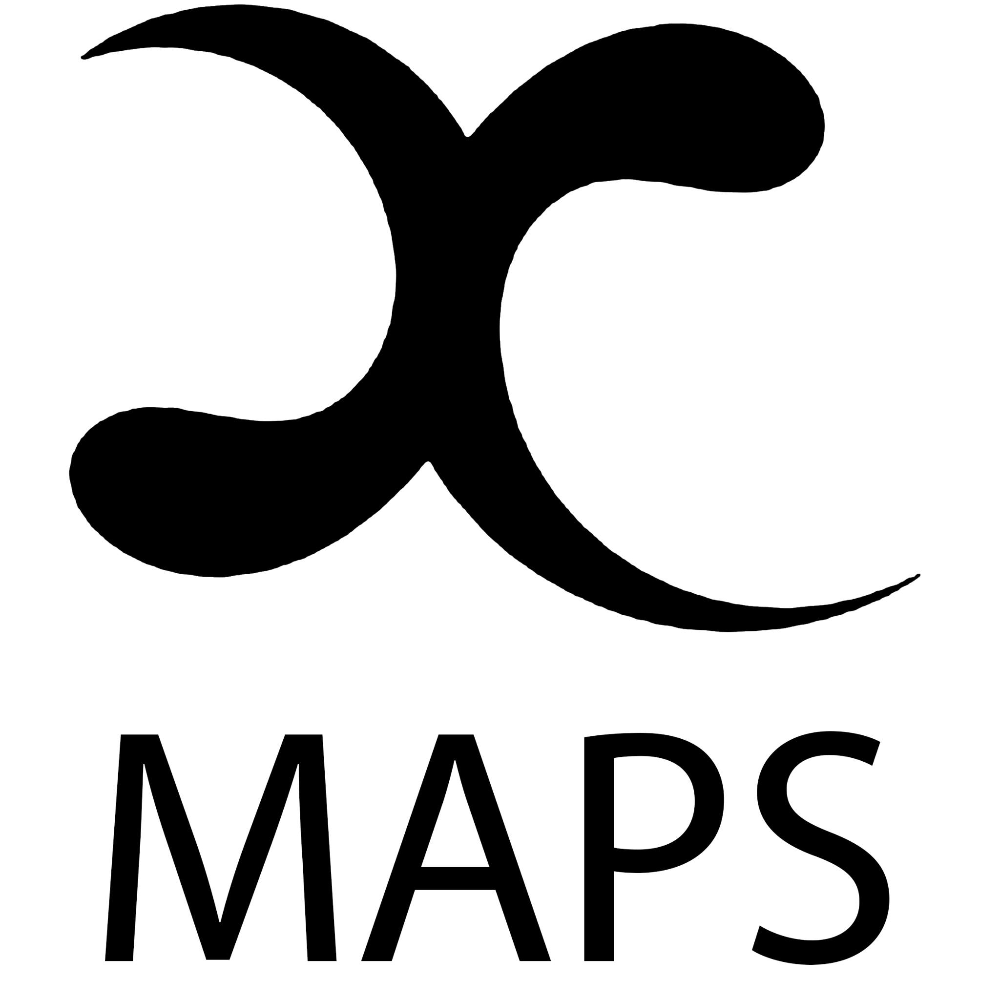

# Welcome to POLUS: the physics lab portal

POLUS, in addition to being the [titan of rational intelligence](https://en.wikipedia.org/wiki/Coeus), is a central location for resources pertinent to the undergraduate laboratory program at UTAS. At this moment in time, it is very much a work in progress, but it is envisaged that this will be a one-stop shop for lab materials and the first port of call for additional resources.

---

## A home for experimental physics at UTAS

The [raison d'être](https://en.wikipedia.org/wiki/Raison_d%27%C3%AAtre) of POLUS consists of four principle motivations, outlined below.

### Experimental content

<!-- [<i class="fas fa-atom fa-5x"></i>](#){ .md-button .md-button--primary class="text-center" style="margin-left: 45%"} -->

[<i class="fas fa-dice-one fa-5x"></i>](partI/index.md){ .md-button .md-button--primary class="text-center" style="margin-left: 30%"}
[<i class="fas fa-dice-two fa-5x"></i>](partII/index.md){ .md-button .md-button--primary class="text-center" style="margin-left: 7.5%"}
[<i class="fas fa-dice-three fa-5x"></i>](partIII/index.md){ .md-button .md-button--primary class="text-center" style="margin-left: 7.5%"}

This site hosts the notes for experiments, in addition to their source files, which can be downloaded and used both as a reference and as an educational resource. Additional material will also be added as it is developed, including computational resources and extension projects..

### Reference material

[<i class="fas fa-book-open fa-5x"></i>](reference/index.md){ .md-button .md-button--primary class="text-center" style="margin-left: 44%"}

A library of curated content that is pertinent to experimental physics and experimentation more generally is provided to help develop knowledge in the area. Content ranges from equipment operating manuals through to example reports with commentary.

### Safety resources

[<i class="fas fa-skull-crossbones fa-5x"></i>](safety/index.md){ .md-button .md-button--primary class="text-center" style="margin-left: 45%"}

Navigating workplace health and safety in the physics lab should not be a chore. On the site, detailed information on how to work safely and also how to develop an understanding of the safety framework are presented.

### User-generated content

[<i class="fas fa-user-astronaut fa-5x"></i>](playhouse/index.md){ .md-button .md-button--primary class="text-center" style="margin-left: 45%"}

Science is a community-based endeavour. Content created by the physics community that is of interest to the physics community is both welcomed and encouraged. Please get in contact if you would like to share some of your content!

---

## External resources

This site is dedicated to hosting content pertinent to experimental physics at UTAS, but related useful content can be found in other locations:

<figure markdown>
<a href="https://www.utas.edu.au/natural-sciences/physics">{width="125" align=left}</a>
<figcaption>The official site for the discipline of physics at UTAS. Here one can find course information along with details about research undertaken at the university</figcaption>
</figure>

<figure markdown>
<a href="https://www.utas.edu.au/natural-sciences/physics">{width="125" align=left}</a>
<figcaption>The group page of the UTAS Mathematics and Physics Society. The group provides support and runs activities to make life as a student in maths and/or physics more enjoyable</figcaption>
</figure>

<figure markdown>
<a href="https://aip.org.au/">{width="125" align=left}</a>
<figcaption>The official site for the Australian Institute of Physics. The AIP is the chief body in Australia dedicated to promoting the role of physics in all aspects of society</figcaption>
</figure>

---

!!! bug "Gotta catch 'em all"
    This site is developed and maintained by the facilities manager for physics. If you come across mistakes, bugs, or have ideas for content or any other quality-of-life improvements, [please get in contact](mailto:physics.labs@utas.edu.au)!

--8<-- "includes/abbreviations.md"
