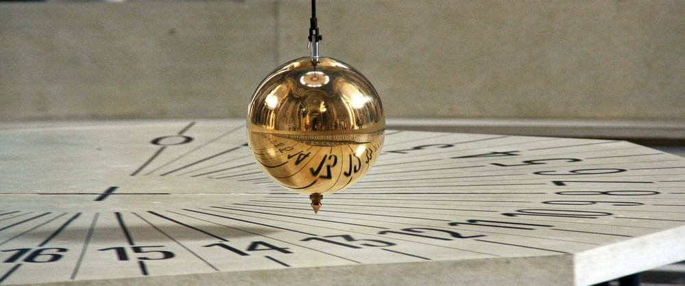

# S1E01: Measurement

This experiment explores how forces are directed during collisions, and investigates the conservation of momentum in real systems.

<figure markdown>
<i class="fas fa-microscope fa-5x"></i>
<figcaption>Relevant concepts:
    Newton's laws of motion  
    Conservation of momentum
</figcaption>
</figure>

---

## Structure

### Files

Data is to be acquired using [Logger Pro](../../reference/software/#logger-pro).

## Additional resources

ARC
