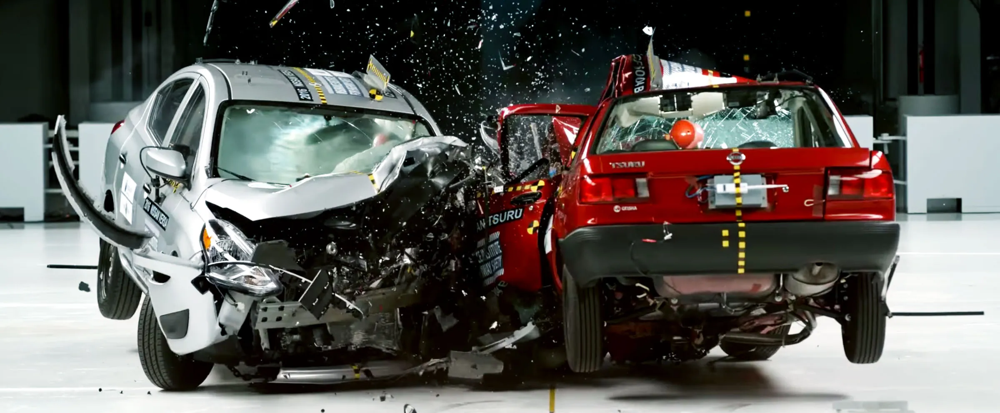

# S1E04: Collisions

This experiment explores how forces are directed during collisions, and investigates the conservation of momentum in real systems.

<figure markdown>
<i class="fas fa-microscope fa-5x"></i>
<figcaption>Relevant concepts:
    Newton's laws of motion  
    Conservation of momentum
</figcaption>
</figure>

---

## Structure

### Files

[Logger Pro](http://localhost:8000/POLUS/reference/software/#logger-pro)

#### Force experiment

<figure markdown>
<a href = 'S1E04a.cmbl'> <i class="fas fa-code fa-3x"></i> </a>
<figcaption>Logger Pro configuration file for the force experiment
</figcaption>
</figure>

#### Momentum experiment

<figure markdown>
<a href = 'S1E04b.cmbl'> <i class="fas fa-code fa-3x"></i> </a>
<figcaption>Logger Pro configuration file for the momentum experiment
</figcaption>
</figure>

## Additional resources

--8<-- "includes/abbreviations.md"
