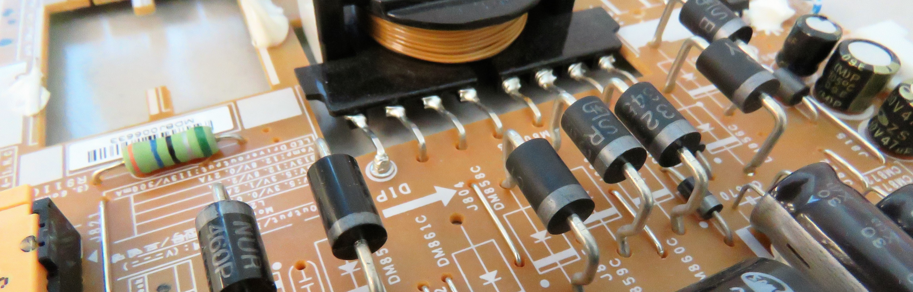

# S2E02: Frequency dependent circuits

This experiment explores how analogue electronic components react to time-varying input signals.

<figure markdown>
<i class="fas fa-microscope fa-5x"></i>
<figcaption>Relevant concepts:
    Electromagnetism  
    Electronic systems
</figcaption>
</figure>

---

## Structure

## Additional resources

<figure markdown>
<a href = 'https://jove2021.cloud.edu.au/hub/user-redirect/git-pull?repo=https%3A%2F%2Fgithub.com%2FAndy-UTAS%2FPOLUS&urlpath=tree%2FPOLUS%2Fdocs%2FpartI%2Fs2e02%2FRLC+circuit.ipynb&branch=master'> <i class="fab fa-python fa-3x"></i> </a>
    <figcaption>Run a Juptyter notebook analysis of the experiment on <a href='../../reference/computation/#cloud-usage'>Jove</a>
    </figcaption>
</figure>

<figure markdown>
<a href = 'https://github.com/Andy-UTAS/POLUS/tree/master/docs/partI/s2e02'> <i class="fas fa-code-branch fa-3x"></i> </a>
    <figcaption>A link to the analysis code as hosted on Gitub
    </figcaption>
</figure>

--8<-- "includes/abbreviations.md"
