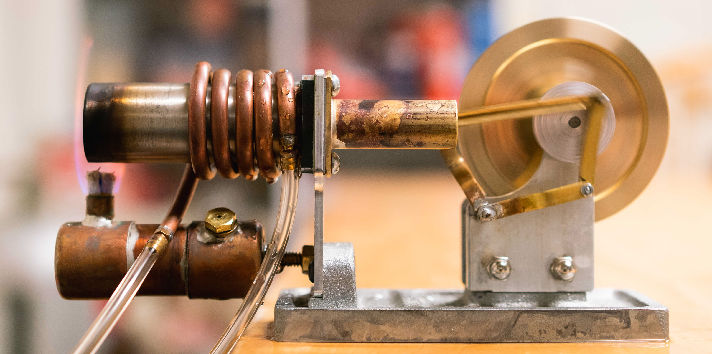

# The adiabatic index of gasses

{: .center}

The period of a ball bearing undergoing lightly-damped, forced oscillations due to pressure variations in a gas reservoir is observed as a way to evaluate the adiabatic index $\gamma$ of the gas. $\gamma$ is a fundamental thermodynamic property of gases that according to theory must take values equal to the ratio of two integers for mono-, di-, and tri-atomic gases. Argon, dry air (O$_2$ $+$ N$_2$), and CO$_2$ are used as examples of the three types. $\gamma$ is related to the compressibility, the sound speed, and the heat capacity of a gas.

---

## Introduction

### Objectives

* To verify that the frequency of oscillation of a pressurised gas system varies according to whether the gas is monoatomic, diatomic, or triatomic.
* To use kinetic theory calculations to measure the adiabatic index $\gamma$ of argon, air, and CO$_2$ from oscillation timing data.
* To see how repeated measurements of a quantity reduce the standard error of the mean measured value.

### Equipment

Gas cylinders and air compressor; "Ruchhardt apparatus" for measuring adiabatic oscillations of a ball bearing (6 glass bottles connected by a manifold to a vertical tube in which the oscillations may be observed); stopwatches; grey notebook with experimental notes and details.  The masses and dimensions of the equipment that you will need in order to evaluate your timing data are given [below](#apparatus-data).

### Principal Data Taken

* Mean period of oscillation of the system for 3 different gases. For each gas, 6 different volumes are tested, and the relationship between period and system volume yields an estimate of $\gamma$.
* The atmospheric pressure $P_0$. The adiabatic index you derive will depend inversely on the pressure in the system. There is a mercury barometer at the front of the room to make this measurement.

#### Apparatus data
| Property | Value |
| :-----: | :-----|
| Diameter of ball |	$15.85 \pm 0.01$ mm |
| Mass of ball | $16.20 \pm 0.15$ g |
| Volume per bottle |	$2.4 \pm 0.1$ L |
| Volume of manifold |	$0.48 \pm 0.02$ L |

### Things to Watch Out For

* Gas flow into the system maintains the oscillations against the light damping. The inflow is regulated by a pressure reduction valve on the cylinder and a bleed-cock valve on the Ruchhardt manifold. The gas flow should be kept low and adjusted carefully since high flow rates will cause the ball bearing to be ejected from the apparatus, possibly damaging the lights, the ceiling, or the students.
* CO$_2$ has a very strong deviation from ideal gas behaviour that causes it to cool upon expansion. This strong cooling can make the valve on the cylinder's pressure regulator ice up and flutter, giving irregular flow and making it impossible to measure the oscillations accurately. Use the smallest possible flow rate of CO$_2$ to avoid this.
* Make sure you understand the operation of the gate valves and capillary tubes connecting the flasks to the manifold. It is essential that the valves are properly set to first allow the flushing of the system, and then to allow a fixed volume of gas to be maintained during the experiment.

## Theoretical Background

The specific heat of a gas depends on whether the gas is heated under conditions of constant pressure or of constant volume. These two parameters are defined by the equations

\[
C_V = \frac{1}{m}\left(\frac{dQ}{dT}\right)_V
\]

is the specific heat at constant volume and

\[
C_P = \frac{1}{m}\left(\frac{dQ}{dT}\right)_P
\]

is the specific heat at constant pressure where $dQ$ is the amount of heat required to raise the temperature of mass $m$ of the gas by an amount $dT$[^1][^2].

The ratio of specific heats gives rise to the important physical parameter $\gamma$:

\[
\gamma = \frac{C_P}{C_V}
\]

$\gamma$ is known as the adiabatic index of a gas. For many gases it is constant over a wide range of conditions. For ideal gases $\gamma$ can only take certain discrete values depending on the molecular structure of the gas. Kinetic theory considerations give

\begin{eqnarray*}
\gamma_{monatomic} & = 5/3 & = 1.67\\
\gamma_{diatomic} & = 7/5 & = 1.40\\
\gamma_{triatomic} & = 8/6 & = 1.33
\end{eqnarray*}

The object of this experiment is to estimate the value of $\gamma$ for various gases employing the method first used by Ruchhardt in 1929 [^3]. Ruchhardt used the kinetic theory of gases to derive a relationship between $\gamma$ and the oscillation period of a system using only simple mechanical calculations and no thermodynamics.  The starting point for the analysis is the fact that for a perfect gas undergoing an adiabatic transformation [^4][^5],

\[
PV^{\gamma} = \mathrm{constant}
\]

where P is the pressure and V is the volume.  This is known as the adiabatic equation for a perfect gas and can be contrasted with the more familiar case for an isothermal expansion or compression, $PV = \mathrm{constant}$.

When the ball is in equilibrium, the pressure in the system

\[
P = P_0 + \frac{mg}{A}
\]

where m is the mass of the ball, g is the acceleration due to gravity, A is the cross-sectional area of the ball, and P$_0$ is the atmospheric pressure. The overpressure in the system supports the ball and prevents it from falling to the bottom of the tube (in reality there is some leakage from the system and the pressure decreases over time).

In Ruchhardt's experiment, a metal ball is free to move up and down within a vertical glass tube connected to a flask filled with the gas for which $\gamma$ is to be measured. It is assumed that frictional losses are small and that the amount of gas escaping past the ball is negligible compared to the volume of the system. As the ball oscillates, the pressure in the system changes by a small amount $\pm$dP.

As the ball is displaced a distance $y$ from equilibrium the volume and pressure change by

\begin{eqnarray*}
dV & = & yA\\
dP & = & F/A
\end{eqnarray*}

where $F$ is the restoring force acting on the ball.  As long as the displacement occurs on a timescale that is small compared to the characteristic time for heat flow into and out of the gas, the condition for adiabatic compression/expansion is nearly satisfied, and $PV^{\gamma} = \mathrm{constant} applies. We can differentiate this relationship

\[
\gamma P V^{\gamma-1}dV + V^{\gamma}dP = 0
\]

and connect the adiabatic equation to the displacement relationships by substituting in for $dP$ and $dV$ from above:

\[
F = -\frac{\gamma P A^2}{V}y .
\]

This is the equation for a force acting on the ball that is linearly proportional to the displacement $y$ and directed towards the equilibrium position. The corresponding equation of motion describes a system undergoing simple harmonic oscillation.  Because of frictional losses that lightly damp the system, the true equation of motion is slightly more complicated; in this experiment the light damping is overcome by a forcing term, namely the constant flow of gas into the system to replace that which is lost.

Fortunately, the period of a constant amplitude, forced oscillation is almost negligibly different from the undamped period as long as the damping is light. Forced oscillations are established by drilling a small hole in the side of the tube. This hole allows a small amount of gas to escape when the displacement of the ball is larger than the height of the hole. Hence the motion of the ball interacts with the gas inflow to produce an additional oscillatory force that acts to sustain the oscillation of the ball about an equilibrium position at the location of the hole.

!!! example "Discuss the following in your report"
    Write out the differential equation of motion (i.e., an expression for $\ddot{y}$), including a term for the frictional losses, and show that it describes a damped oscillator with period $T$ given by

    \[ \label{eqn:period}
    T \approx 2\pi\left(\frac{mV}{\gamma PA^2}\right)^{1/2}
    \]

Rearranging this equation shows that

\[
\gamma = \frac{4\pi ^2mV}{A^2PT^2}
\]

The parameters $A$, $m$, $V$, and $P$ are easily measurable, and the period $T$ can be measured with a stopwatch. A look at [the rules for propagation of error](../reference/experiment/#estimating-uncertainty) can help you estimate the precision with which you need to measure $T$ in order to distinguish between possible values of $\gamma$ (1.40, 1.33, etc.).

## Procedure

From the theoretical background, you have found a relationship between the oscillation period and adiabatic index in a gas system that depends on the volume. By measuring the period at a succession of different volumes, an accurate estimate of $\gamma$ may be obtained.

In this experiment you will measure the oscillation periods at six different values of the system volume. The number of gas bottles that participate in the oscillation may be varied by controlling the values in the system, so that the volume changes from six flasks all the way down to a single flask. You will likely find it easiest to start with the largest volume, i.e., all six flasks connected, and work your way down to the single flask.

First the system must be prepared by flushing out the previous gas that fills the bottles. It is essential that the system be well-flushed out when changing gases-- a minimum of 15 minutes flushing time is recommended. The new gas should be introduced via the pinch-cocks and fine copper tubes. These extend to the bottom of the bottle and the flushing action is likely to be most effective if a heavy gas is used to displace a lighter one. Hence you should make your measurements first with air, then with argon, and finally with CO$_2$.

Detailed instructions (and diagrams) may be found in the grey notebook on the lab bench nearest the Ruchhardt apparatus.

If necessary, start the oscillations by briefly holding your thumb over the top of the glass tube. This will cause the pressure to build up and slightly compress the air inside the flasks, overcoming the internal friction in the system. The gas pressure should be adjusted very carefully using the stopcock so that the ball oscillates with constant amplitude.

Repeat the measurements for each of the possible values of V, and each of the gases. You will find it useful to time multiple periods of the oscillation in order to minimise the random uncertainties in the results.

## Calculations

Use the method of least squares to plot the relationship between period and volume. Is there any indication of a departure from the expected period $T$ as derived?
If yes, suggest possible reasons. Use the parameters from your equation of the line of best fit to calculate the value of $\gamma$ and the standard error $\sigma_{\gamma}$ from your data.

??? info "A table of the adiabatic index $\gamma$ of common gases at a 20$^{\circ}$C"
    | Gas | Structure | $\gamma$ |
    | :-----: | :-----: | :-----: |
    | Argon | Ar, Monatomic | 1.670 |
    | Nitrogen | N$_2$, Diatomic | 1.403 |
    | Oxygen | O$_2$, Diatomic | 1.400 |
    | Carbon dioxide | CO$_2$, Triatomic | 1.300 |

    The commonly accepted values for $\gamma$ are taken from Kohler [^5]. Note that these are not identical to the values from the most simplistic application of classical kinetic theory, partly due to non-ideal gas effects, and partly due to quantum effects.

Are your values for $\gamma$ significantly different from the accepted values for argon, air, and CO$_2$? Recall that differences of $\pm$1$\sigma$ are expected to occur just due to random experimental variation about 32% of the time, while $\pm$2$\sigma$ differences are expected only 5% of the time.  If significant differences are found, consider the theoretical background and experimental apparatus to suggest possible sources of systematic error.

[^1]: C. J. Adkins, _Equilibrium Thermodynamics_, (McGraw-Hill, London, 1968), p. 43.
[^2]: E. Fermi, _Thermodynamics_, (Dover, New York, 1956), p. 20.
[^3]: C. J. Adkins, _Equilibrium Thermodynamics_, (McGraw-Hill, London, 1968), p. 119.
[^4]: E. Fermi, _Thermodynamics_, (Dover, New York, 1956), p. 25.
[^5]: W. F. Köhler, _Amer.\ J.\ Phys._ **19**, 113
[^6]: M. W. Zemansky, _Heat and Thermodynamics, 5th ed._ (McGraw-Hill, New York, 1968) p. 128

--8<-- "includes/abbreviations.md"
