# Digital systems: an introduction

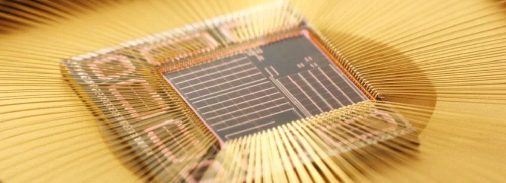{: .center}

Electronic systems underpin modern life, from seemingly banal devices such as fridges and cooktops, through to our most advanced devices such as supercomputers and space robots. It is therefore worthwhile that we spend some time to appreciate how is it exactly that these devices function? What are the basic building blocks which allow for the construction of all manner of wonderous widgets?

!!! info "Objectives and learning outcomes"
    * Obtain familiarity with the basic concepts of digital systems
    * Use a microcontroller to "read" and "write" states of electronic components via software

---

## Introduction

Famously, the [Apollo Guidance Computer](https://en.wikipedia.org/wiki/Apollo_Guidance_Computer) - the computer that allowed humans to walk on the moon - is significantly less powerful than the computational power of even the most basic of mobile phones. But what does that actually mean? And from where does this power come from? To gain an appreciation of the "power" of a computer is really hard, as humans are terribile at conceptualising things which are not linear, so when one is hit the numbers such as

* The [first intel processor](https://en.wikipedia.org/wiki/Intel_4004) had 2250 transistors
* At the time of writing, the [most powerful intel processor](https://en.wikipedia.org/wiki/Sapphire_Rapids) has $4.4 \times 10^9$ transistors

the fact that the transistor count - and as we shall see, the number of calculations - is a million times greater doesn't register as mind blowing, when it really should.

### Backgound

Early experiments and systems which manipulated electric and magnetic fields are inherently _analogue_. The basic analogue components come in three flavours:

1. Resistance
2. Capacitance
3. Inductance

!!! question "Exerscise 1"
    Explain the physics origins of each of the above electromagnetic properties of materials

Mordern electronics rely largely on _digital_ systems, which in contrast to their analogue sibling, are much simpler, and are inherently ready to be connected together to make complex systems. We are not going to go too far into the weeds of how exactly one builds a machine for computation, but we are going to have a bit of a glance.

### Logic

Digital systems have two states: and _on_ state, and an _off_ state. It should then come as no surprise that the most basic building block of a digital system is a switch, which is either _on_ or _off_. The magic starts to happen when we intoduce logic, namely devices which take input values and transform them to a single output value. A simple example of a logic gate is one constructed in a circuit as shown below: each of the two switches can either be open (_off_) or closed (_on_), but only when both switches are closed will the light be illuminated.

<figure markdown>
  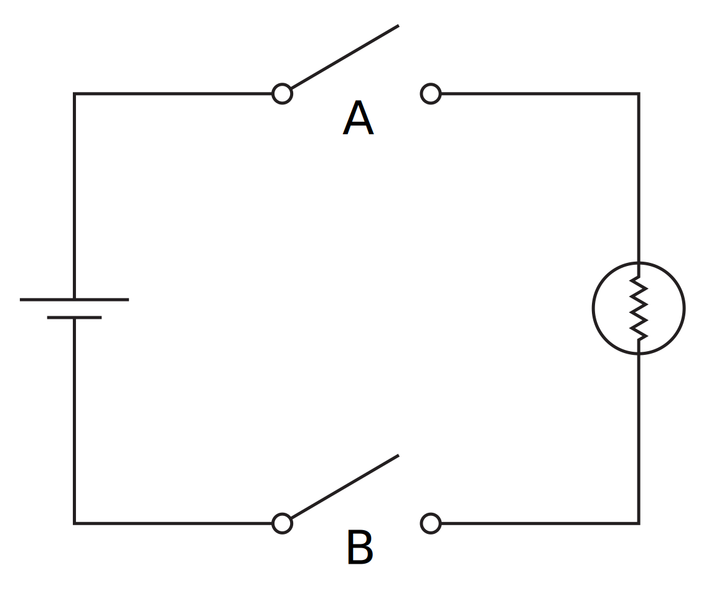
  <figcaption>An AND gate as depicted using switches in a circuit: only when both switches are closed will the light illuminate.</figcaption>
</figure>

To represent these structures mathematically, we can use truth tables, which adopt the convention of the _off_ state being represented by `0` and the _on_ state being depiced by `1` and display all states of the system. The truth table for the system as depicted above (an _AND_ gate) is:

| A | B | Output |
| :----------: |  :----------: |  :----------: |
| 0 | 0 | 0 |
| 0 | 1 | 0 |
| 1 | 0 | 0 |
| 1 | 1 | 1 |

!!! question "Exercise 2"
    Make the truth table for the following system:

    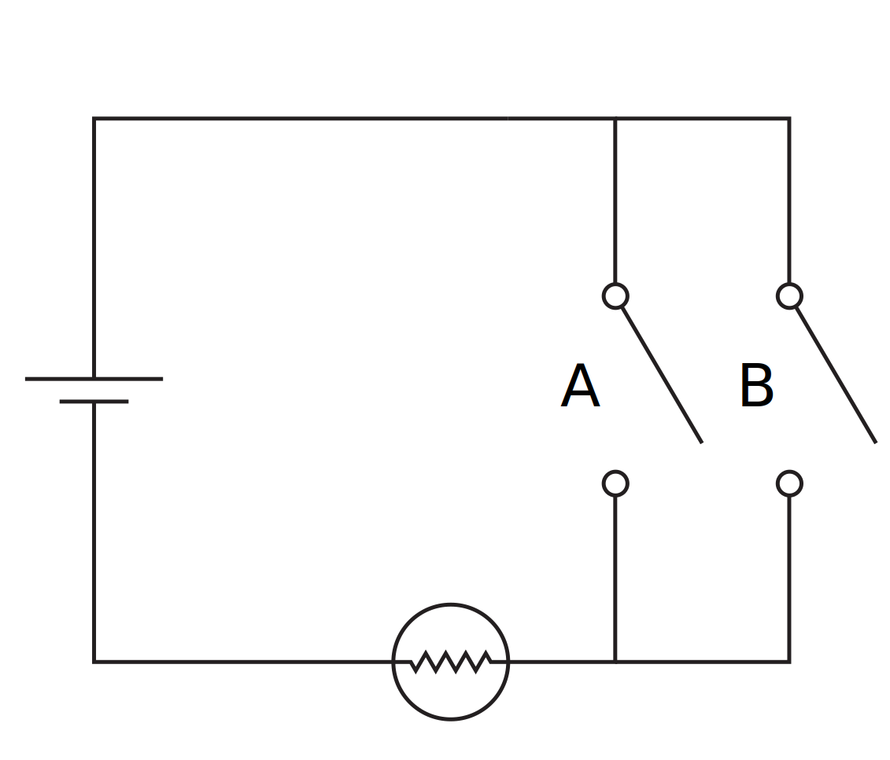{width=75% : .center}

    and have a guess the name of this logic operator.

We are not going to go through all the possible ways that one might construct logic gates, but hopefully you can see how one might be able to chart a path to other logic gates, along with sequences of logic gates which can start to permit simple operations, from which we can execute further operations. If you are interested in delving into this, along with additional topics such as how to store digital information, an [excellent video series](https://www.youtube.com/watch?v=QZwneRb-zqA&list=PLFt_AvWsXl0dPhqVsKt1Ni_46ARyiCGSq) is thoroughly recommended, along with a [digital logic simulator](https://github.com/DigitalLogicSimCommunity/Digital-Logic-Sim-CE).

### Microcontrollers
We have just seen that a collection of switches allows us to create logic gates. The secret sauces which have let computation grow into the juggernaut that we know it to be are (information theory)[https://en.wikipedia.org/wiki/Information_theory] and transistors. The former we are not going to cover as it is a field onto itself, but the latter is much more unsterstanable: in short, transistors are effectively little switches, and our ability to make more transistors per unit area has drastically increased since we started making them[^1], so our ability to build systems capable of logical operations has also increased drastically. This is the story of computational power: better fabrication techquies for transistors means more powerful devices, simply as there are more little pieces of computation inside.

A story which runs parallel to the development of computing hardware is software. At the end of the day, programming all of the logical operations required to complete a given task is tough work, and there is no way around having to do this: machine code is the only language that a computer speaks. However, as computaitonal power grows, the amount of power we are willing to dedicate to making our lives easier increases. A good example of this is an old operating system: if you look at early versions of windows, linux, or OS X, they typically look a little janky, laking polish. This isn't because it wasn't possible to do these things, it was because the amount of power required to do those things would mean performance for important tasks would be compromised; however, with a few years passing, one typically has much more computing power to play with, so for accomplishing the same important tasks, one can have a _very_ shiny operating system. The same can be said for coding languages: we now commonly use "shiny" languages, which are not the most efficient languages, but are drastically easier to code. For example, `python` is the language of choice for most scientific applications, and whilst using a lower level language such as `C` would likely result in a faster computation, when both programs run faster than $100~\textrm{ms}$, the computation time often doesn't matter, and `python` has all the creature comforts of a high-level language.

<figure markdown>
  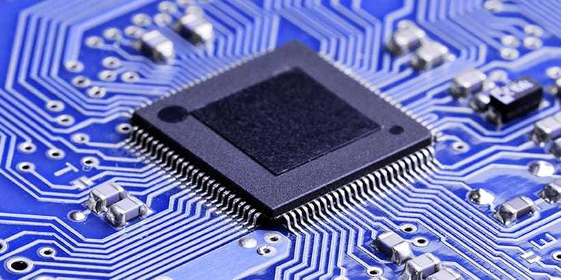
  <figcaption>A microcontroller at home on a PCB</figcaption>
</figure>

We have discussed the construction of computational devices, and the development of cosy coding languages, and it the nexus of these that the user-friendly microcontroller was born. Microcontrollers are collections of logic gates which can be controlled to perform specific operations; however, programming them was not always easy. Moreover, When it came to deciding which microcontoller to use, there were many considerations (and hence a large number of microcontrollers in the wild). Delightfully, there has been somewhat of a revolution in the last decade with mass-produced, low-cost, and highly-accessible - easily coded - microcontollers being brought to market. It is here that we have our jumping off point: microcontollers (little computers) that we can easily control (using code) to control and measure all manner of things - which is a cornerstone of experimental physics.

## Apparatus

The nature of this digital systems tutorial means that we will be performing a number of bite-sized experiments, and as such the apparatus will need to be reconfigured for each experiment; however, at the core of all experiments are two common elements. These are a microcontroller, the [Raspberry Pi Pico](https://www.raspberrypi.com/documentation/microcontrollers/raspberry-pi-pico.html), and the coding enviroment we shall use to program the microcontroller: [Thonny](https://thonny.org/).

### The Raspberry Pi Pico
The two most common microcontrollers are the [Arduino](https://www.arduino.cc/en/Guide/Introduction)[^2] and the [Raspberry Pi Pico](https://www.raspberrypi.com/documentation/microcontrollers/raspberry-pi-pico.html). In the case of the latter, these should not be confused with the [Raspberry Pi SBC](https://www.raspberrypi.com/products/raspberry-pi-4-model-b/) which are produced by the same company, but are very differnt products.

??? info "Why the Raspberry Pi Pico?"
    Given the Arduino and the Raspberry Pi Pico are both commonplace, why choose one over the other? The reasons we use the Pico are

    1. It can be programmed using Python[^3]
    2. It has a convenient form factor

<figure markdown>
  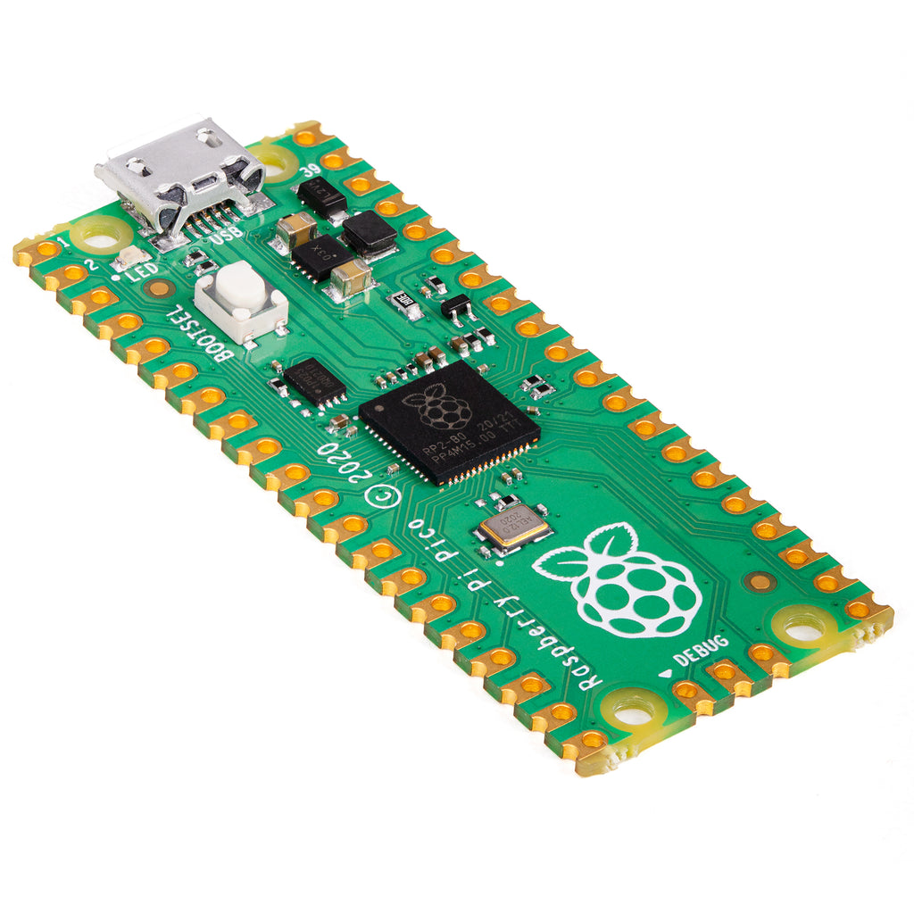{width=75% : .center}
  <figcaption>A Raspberry Pi Pico board, with the RP2040 microcontroller visible in the centre of the board</figcaption>
</figure>

The [Raspberry Pi Pico](https://www.raspberrypi.com/documentation/microcontrollers/raspberry-pi-pico.html) is a board based around the [RP2040](https://www.raspberrypi.com/documentation/microcontrollers/rp2040.html#welcome-to-rp2040) microcontroller, which we are going to program the get information both to and from experiments.

!!! Example "How do I make it go?"
    The following experiments are going to cover the basics of using a Raspberry Pi Pico, but there are no shortage of excellent introductions which can be found elsewhere, for example, the [Raspberry Pi Foundation](https://www.raspberrypi.org/) has a guide to [Getting started with Raspberry Pi Pico](https://projects.raspberrypi.org/en/projects/getting-started-with-the-pico/0).

### Thonny

We have our hardware, but now we need to talk to it and for better and worse, the only language it speaks is code. In order to program our Pico, we are going to use a `MicroPython`, which walks and talks like the `Python` language, only it is pared back: ordinary `Python` is designed to run on big computers whilst `MicroPython` is designed to run on little computers, i.e. microcontrollers. To write our programs and transfer them to the Pico, were are going to use [Thonny](https://thonny.org/) - a barebones `Python` IDE.

!!! danger "Help, I don't know coding!"
    This tutorial does not assume that you know coding. We are going to do some coding, but as you will come to see, learning to often code involves looking at functional code, and bending it to your will through experimentation and experience. You can find some resources on this site the providing both [some background](../../reference/computation/) and [explicit detail](../../reference/computing/); however, this page is designed to be self-contained, so take a deep breath, and let's go!  

## Experiments

The nature of this digital systems tutorial means that we will be performing bite-sized experiments, which will involve both building a circuit and coding the Pico. Hopefully this taster will prime you to realise how powerful these devices are and how you might harness them during you physics studies, but also futher afield.

### "Hello, World!"

The very first task one usually performs when setting out on a new coding adventure is to let the world know that you are alive. The microcontroller equivalent of saying "Hello, World!" is blinking an LED, so that is what we are going to do. Connect the Pico to a lab computer with a USB cable and open Thonny, and verify the program has connected to the Pico by checking the `Shell` tab in Thonny looks as shown below:

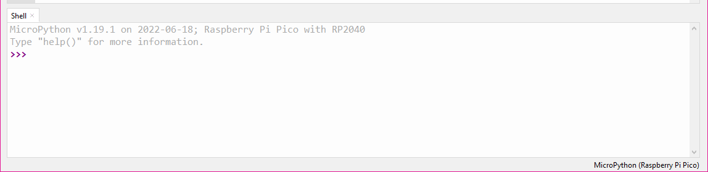{: .center}

??? info "Help! Thonny does not look like the image above"
    If Thonny is not connecting to your Raspberry Pi Pico, there are a few common causes for this, which can be rectified by trying the following in order:

    1. Verify that the USB cable is properly connected to both the computer and the Raspberry Pi Pico board
    2. Flash the `MicroPython` firmware to the Pico, which is done following [these instructions](https://projects.raspberrypi.org/en/projects/getting-started-with-the-pico/3)
    3. Restart Thonny

    If Thonny still does not connect to your Pico, consult with your demonstrator.

Remaining in the `Shell` tab, type the following lines:

``` python linenums="1"
from machine import Pin
led = Pin(25, Pin.OUT)
```
If you are unframiliar with code, this may all look a bit strange, but we are going to break it down. The first line imports the `#!python Pin` class from the `#!python machine` module, meaning that there is a bunch of code hidden in the background relating to controlling input and output pins of the Pico, but we get to use much more understandable code to actually make it go. Explicitly, this takes the form of the second line where we make an object, and it so happens that pin number 25 on the Pico is connected to an LED that is on-board, and we want to have this pin have current flow (or not), turning on (or off) the LED, so we telling the microcontroller

> Create an object, call it "led", and have this be linked to an output on pin number 25.

With this done, we can now execute the function:

``` python
led.toggle()
```

!!! question "Exerscise 3"
    What do you think will happen if you execute the above line of code again? Do it, and find out.

### Blinky Bill
Hopefully you found some joy in making the on-board LED blink, but imagine that you had to have the LED blink on and off at set intervals, and you didn't want to sit at a computer executing

``` python
led.toggle()
```

until the end of days. The benefits of using `MicroPython` start to become apparent when we integrate standard `Python` modules such as the `time` module. Semantically, we want to import the time module, and then use it make a delay for turning the LED on and off. We will also now shift to executing an entire program rather than just individual lines of code. Rather than exectuing the code in the `Shell` window, write the entire program in the main window and then save the file. When prompted as the where to save the file, select `Raspberry Pi Pico` so the code is save on the Pico itself.

``` python linenums="1" title="Hello, World!"
from machine import Pin
led = Pin(25, Pin.OUT)

led.toggle()
```

??? example "With nothing other than the code above, try to import the `time` module, and use it to switch the LED on and off every second. The function `#!python time.sleep()` may be of some use"
    `Python` (and by extension, `MicroPython`) are somewhat intuitive languages, so in order to accomplish the given task, we could try something along the lines of

    ``` python hl_lines="2 7 8" linenums="1"
    from machine import Pin
    import time

    led = Pin(25, Pin.OUT)

    led.toggle()
    time.sleep(1)
    led.toggle()
    ```

    where the highlighted lines are the only lines added to our previous program. To make this a truely labour-saving device, we could use a `#!python while` loop:

    ``` python title="BlinkyBill.py"
    from machine import Pin
    import time

    led = Pin(25, Pin.OUT)

    while True:
        led.toggle()
        time.sleep(1)
    ```

    !!! question "Exerscise 4"
        What do you think will happen if you execute the above Program? Do it, and find out.

### LED lighthouse
Look at us! Blinking an LED, what next!? Well, perhaps you find the transition from the LED flipping between on and off a bit harsh? Or maybe you want to emulate the romantic glow of a distant lighthouse flashing? In either case, this is something we can look into. But first, we need to discuss the what the Pico actually does when we tell it to output.

The Pico has many Input (I) and Output (O) pins, with the full collection shown below:

<figure markdown>
  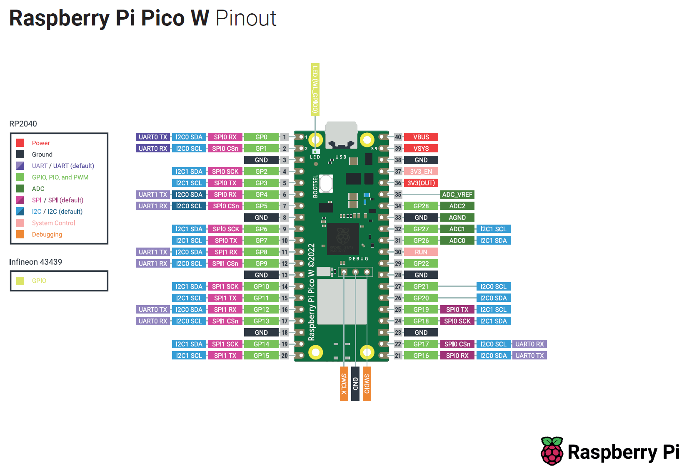
  <figcaption>The pinout diagram for the Raspberry Pi Pico</figcaption>
</figure>

The pins that are of most interest to us are the GPIO pins, which as the name suggests are general purpose and can be assigned to perform a range of tasks (for example, illuminating an LED). Importantly, any output from the Pico is a _digital_ output, which is either _on_ or _off_, `1` or `0`, which in reality correspond to the voltages $3.3\mathrm{V}$ and $0\mathrm{V}$ respectively. Contrast this to an _analogue_ output would do: the voltage would be whatever I set it to be, whereas the _digital_ output is comparitively a blunt instrument. So given it can only be either _off_ or _on_, how are we going to dim our LED?

!!! question "Exerscise 5"
    What is PWM? What is duty cycle? Explain how PWM can be used to dim an LED.

!!! abstract "Smooth operator"
    Here we are going to work through how one might build code from the "ground up". As stated previously, this typically involves looking at documentation and example code, altering it, breaking it, fixing it, and then hopefully achieving that which you set out do. In this case, we are going to use PWM to dim our LED.
    1. Copy our code from above which blinks the LED _on_ and _off_
    2. Search something along the lines of "micropython PWM" and find the relevant documentation for the function
    3. Integrate the function into the code from step 1, with a goal of having the light pulse _on_ and _off_ continuously

    ??? example "Use the above recipe to try and create a program to pulse the LED, then try it!"
        An example program to pulse the LED is

        ``` python title='LED_lighthouse.py' linenums="1"
        from machine import Pin, PWM
        import time

        pwm = PWM(Pin(25))

        pwm.freq(1000)

        while True:
            for duty in range(65025):
                pwm.duty_u16(duty)
                time.sleep(0.0001)
            for duty in range(65025, 0, -1):
                pwm.duty_u16(duty)
                time.sleep(0.0001)
        ```

        The secret sauce can be found in the [class documentation](https://docs.micropython.org/en/latest/library/machine.PWM.html) and a [related tutorial](https://docs.micropython.org/en/latest/esp8266/tutorial/pwm.html) for PWM using `MicroPython`; the code above expands on the previous code by importing the PWM class, creating a PWM object for Pin 25, and then we set the PWM cycle frequency to $1000\mathrm{Hz}$. It is at this point that one could run `#!python pwm.duty_u16(duty)` where `duty` is any number between 0 and 65,025, yielding a duty cycle between 0% and 100% respectively. You may ask:

        > How on Earth would I know to do that!?

        and the answer is you wouldn't: [it comes from reading the docs](https://docs.micropython.org/en/latest/library/machine.PWM.html#machine.PWM.duty_u16). Learning to do this stuff requires much searching and reading, so don't worry if you don't immediately take it all in. The best part of it is that you can simply try to execute the code and see what happens, and make any changes as required.

        We then assign sequential values of the duty cycle from for 0% to 100%, which is best done in `Python` using a `#!python for` loop, where we loop over all possible values of the duty cycle, i.e. `duty` $\in [0,65024]$. We include a small sleep time just to make things smoother, as doing things too quickly can result in a flicker. Once we have increased through all possible values of the duty cycle, we can then turn around and descend through all values duty cycle, and then continue this forever by placing everything inside a `#!python while True` loop.


### Digital analogue

Playing with the onboard LED is great fun, but the purpose of these experiments is to build capacity for using a microcontroller in physics experiments, so we are going to branch out, and interact with componenets which are not directly attached to the Pico, and explicitly, our goal is to create a physical LED dimmer. Before we get to building a dimmer, we need to connect up our Pico to other components, and for this we are going to use a breadboard.

??? tip "Unfamiliar with electronics breadboards?"
    _Solderless breadboards_, or simply _breadboards_, are a fantastic tool for prototyping electronics: they allow for a "plug and play" approach to building circuits, requiring few leads for connections and fitting almost all standard components. Essentially, breadboards are an array or wire strips, connected in rows but not in columns. This means that to connect up two (or more) components, one must simply plug them into the same row. The image below shows the breadboard and the internal connections are annotated.

    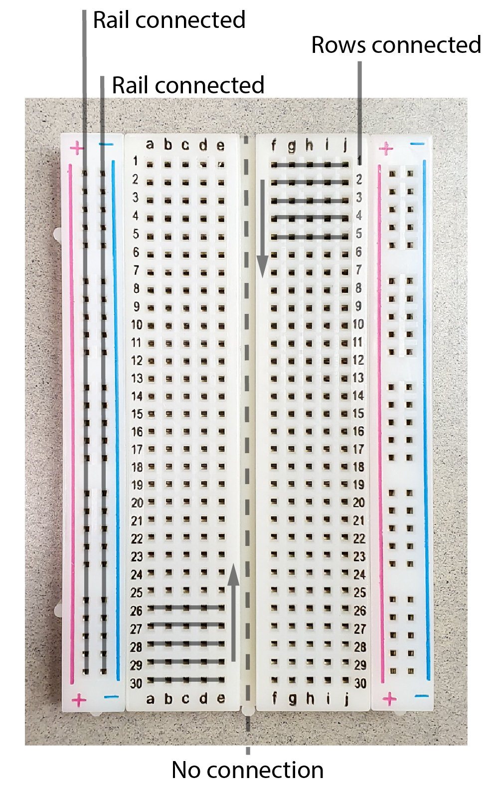{width=75% : .center}

The Pico has soldered headers which make it ideal to straddle the centre of the beadboard (i.e. columns `C` and `H`) so we can easily connect jumper cables to any pin we desire. Our goal here is to replicate our LED adventure thus far but on an isolated LED rather than the on-board LED, but first, a quick note on LEDs.

An LED is a semiconductor component that emits light when current flows through it. Importantly, in addition to emitting light, LEDs - and diodes more generally - only conduct current in one direction: ideally it has zero resistance for current flowing in the forward direction and infinite resistance for current flowing in the reverse direction. It is therefore very important to pay attention to the polarity of an LED: in the wrong orientation, it will not allow current to flow nor will it produce any light. **The positive side (anode) of the LED can be readily identied as it has a longer leg.**

Given that diodes have varying resistance dependent on the direction of current, they clearly do not obey Ohm's law. Rather, diodes require a certain voltage in order to "turn on", that is, to allow current to flow, but beyond this the current and voltage are mostly independent. The voltage required for operation is known as the foward voltage ($V_f$) and is typically in the range $0.3 - 2 \mathrm{V}$ depending on the diode material. Even though LEDs are non-Ohmic devices, they emit light with a brightness proportional to the current passing through the diode, just light a globe. **And much like a globe, if too much current is passed though the diode, it will be destroyed. Therefore a resistor must always be placed in series with the diode to limit the current a prevent damage to the LED**.

<figure markdown>
  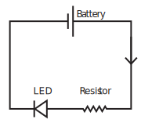{ width = 50%}
  <figcaption>A circuit to safely power an LED</figcaption>
</figure>

!!! question "Exerscise 6"
    Using the provided LED and $220~\Omega$ resistor, construct the above circuit where the battery is replaced by an output of the Pico. This involves selecting a GPIO pin from the [pinout](#led-lighthouse) and writing a program to turn that pin _on_. You should be able to manually switch the LED, or by altering previous pieces of code, either blink or pulse the LED.

We are now going to use a potentiometer to control the brightness of our LED, but not by using the potentiometer to limit the current to the LED, but rather by using an analogue input of the Pico to sense the position of the potentiometer.

<figure markdown>
  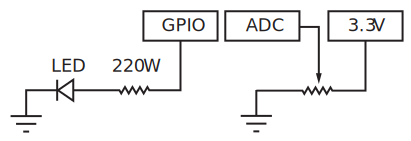{width="600"}
  <figcaption>A circuit control the LED brightness with a potentiometer</figcaption>
</figure>

The right-hand side of above circuit will sample that the potentiometer output, which is measured using an ADC, the details of which are provided [elsewhere on this site](../../reference/hardware/#pico-technology-adc20-and-2000), but the summary is that a signal continuous in both time and voltage is _sampled_ which results in a signal discritised in both time and voltage. The accuracy of the voltage represenation will be determined by the _resolution_ of the ADC, which is essentially determined by the maximum measurable voltage over the bit depth. For a Pico, the digitised signal will range in value from $0 - 65025$ which represent signals of $0-3.3\textrm{V}$ respectively. In order to programatically read the voltage, we simply need to import the `#!python ADC` class and then tell the Pico which pin to read. Try running the below code, ensuring to verify the ADC pin on the [Pico pinout](#led-lighthouse):

``` python title="Potentiometer read"
from machine import ADC, Pin
import time

adc = ADC(Pin(26))

while True:
    print(adc.read_u16())
    time.sleep(1)
```

!!! question "Exerscise 7"
    By combining all our coding adventures, write a program which dims the brightness of an external (not on-board) LED based on the position of a potentiometer.

### Time to switch off (and on)

Our final experiment is aims to externalise all that we have learnt. Specifically, there are many situations where we would like to control things that cannot be simply powered from our Pico. A real-world example might be the opening and closing of a garage door: the motors to drive the door require significant power, well beyond the capabilities of our Pi; however, if we were to simply control a switch in the motor circuit with our Pico, we could retain the programability of our Pico, with the functionality of the externally powered motor. The question is then, what is an electronically powered switch? It is at this point that we have come full circle, as the answer is a _transitor_. The schematic below shows a common type of transistor (a NPN BJT) which is commonly encountered in low-energy switching appilcations.

<figure markdown>
  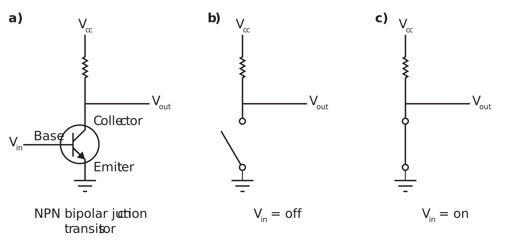{width="800"}
  <figcaption>The NPN bipolar junction transistor. a) The BJT as it appears in circuit diagrams b) the effective circuit when $V_{in}$ is a logical off c) the effective circuit when $V_{in}$ is a logical on</figcaption>
</figure>

!!! question "Exerscise 7"
    Construct the following circuit
    <figure markdown>
      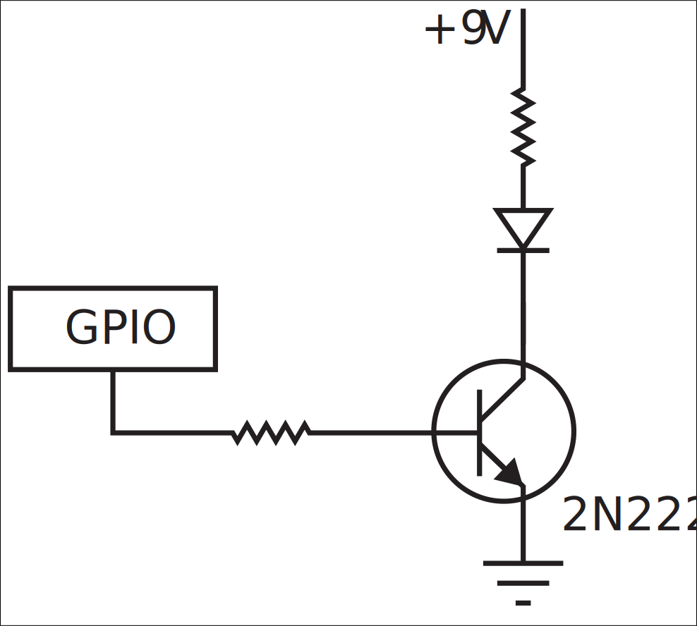{width="500"}
      <figcaption>A circuit to switch an externally powered system</figcaption>
    </figure>
    and use the snippets of code that we have used thus far to periodically switch an externally powered LED.

    !!! tip "Hint"
        The terms "pull-up" and "pull-down" resistor might be worth searching

[^1]: The number of transistors has approximately doubled every 18 months, as described by the oberservation known as "Moore's Law"
[^2]: Notably the [Arduino Uno](https://store.arduino.cc/products/arduino-uno-rev3) which is based around the [ATmega328](https://en.wikipedia.org/wiki/ATmega328) chip
[^3]: Technically, it is programmed using [MicroPython] which is an implementation of `Python 3` for microcontrollers

--8<-- "includes/abbreviations.md"
