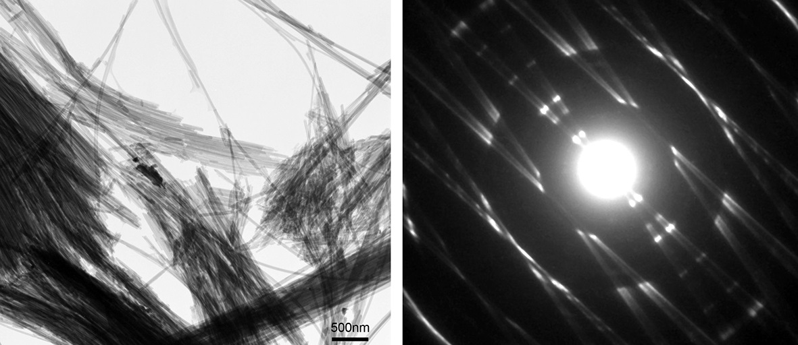
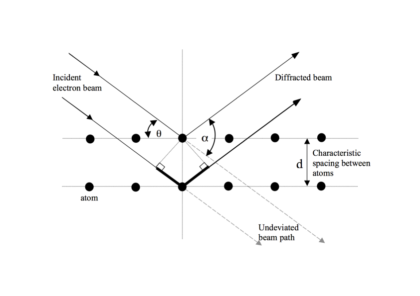
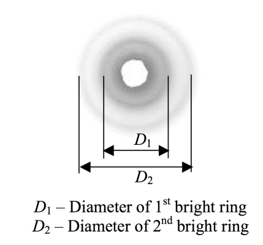
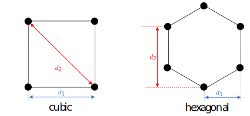

# Electron diffraction

{: .center}

A thin piece of highly-ordered material is considered as a diffraction screen with aperture spacings determined by the atomic spacings in the sample. Observations of the patterns that result when electrons accelerated through several kilovolts hit a chip of graphite can be used to prove that electrons can exhibit wave behaviour in accordance with deBroglie's hypothesis, and to probe the spacing and arrangement of graphite atoms on scales $\lesssim$10$^{-9}$ m.

---

## Introduction

### Objectives

* To observe the wave-like properties of electrons interacting with an ordered atomic lattice.
* To observationally check de Broglie's predicted momentum-wavelength relationship for electrons.
* To use the spacing of diffraction rings on a screen as a measurement of the spacing and orientation of carbon atoms within a graphite target.

### Equipment

"TEL-Atomic" 555 electron diffraction tube, 5 kV high voltage power supply,  vernier callipers.

### Principal Data Taken

* Dimensions of the diffraction pattern produced by an electron beam projected onto a curved phosphor-coated screen as a function of accelerating voltage.

### Things to Watch Out For

* The high voltage power supply provides a small current (in the mA range) but a very high voltage. Ensure that all leads and connections are secure and protected before turning on either one of the power supplies.  Observe all usual care and attention necessary when working with electricity.
* The bright spot in the centre of the phosphor screen has the potential to damage the screen if left on too long. Reduce the power supply voltages to zero once measurements have been made.

## Theoretical Background

Einstein's work on the photoelectric effect showed that light, previously considered a wave phenomenon, also displays particle behaviour. In 1924 Louis de Broglie developed a generalised version of the equations relating the wavelength of light to the momentum of photons, and postulated in his doctoral thesis that particles might also display wave behaviour. de Broglie hypothesised that the inverse proportionality between wavelength and momentum should hold true for all particles; the electron was the lightest known particle at the time, so it was the easiest case for experimenters to test, which Davisson and Germer successfully did in 1928.

Electrons accelerated by a high voltage have an associated kinetic energy, which means they have a corresponding linear momentum.  Therefore according to de Broglie's formula we would expect those electrons to have an associated wavelength.  Davisson and Germer tested this hypothesis by placing a suitable diffraction screen in the path of such an electron beam. Diffraction is an interference effect that is fundamental to the propagation of waves, and should be observable for electrons just as with any other wave. However, diffraction gratings developed for optical purposes are totally unsuitable for the demonstration of electron diffraction (briefly explain why in your report), so a quite different experimental set-up must be used.

Consider a beam of electrons directed at a phosphorescent target. If the beam is not deflected then it will produce a single bright dot where electrons impact the screen. If a diffusing target is placed in the beamline, then individual electrons will scatter off of atoms in the target, creating a slightly blurred spot on the screen. The atoms in the target are fixed in position, with some regular or irregular spacing depending on the target material. If the electrons always behave as particles, then diffraction cannot occur and the pattern on the screen would resemble a Gaussian distribution. The pattern would change in intensity and width with increasing electron energy based on conservation of momentum applied to each electron-atom collision, but would always have a peak at the unscattered beam position and drop off smoothly with increasing scattering angle.

On the other hand, if the electrons can behave as waves, then if the spacing between target atoms is comparable to the wavelength of the electron "matter waves", we would expect to see a diffraction pattern caused by interference between electrons scattered from atoms in different layers of the target. According to de Broglie's hypothesis, the electron wavelength is inversely proportional to their momentum, and so the minima and maxima of the diffraction pattern should change in a regular way with electron momentum (and therefore, electron energy, which is directly controlled by the experimenter).

For this experiment, graphite has been deposited on a screen as a target. In this form, it is a poly-crystal with micro crystals oriented in many random directions, and we can therefore sample many angles of incidence without needing to vary the direction of the electron beam or the orientation of the target. If the wavelength of the incident light (or particle) is of the order of the separation between the atomic planes in the crystal, the planes will act as a three- dimensional grating.

!!! info "Discuss the following in your report"
    * The de Broglie wavelength of a particle is given by
        \[ \label{eqn:debroglie}
        \lambda = h/p
        \]

        where $h$ is Planck's constant, p is the particle momentum, and $\lambda$ is the wavelength. $h$ takes the value 6.626$\times$10$^{-34}$ J$\cdot$s = 4.136$\times$10$^{-15}$ eV$\cdot$s. What is the predicted wavelength of an electron with kinetic energy K = 3 keV? If a ray of light had this wavelength, in what part of the electromagnetic spectrum would it be?

    * Make an _estimate_ of the spacing between atoms in a piece of graphite. Start by recalling that 12 grams of carbon-12 contain 6.022$\times$10$^{23}$ atoms, and the density of graphite is measured to be $\rho$ = 2.2 g$\cdot$cm$^{-3}$. This is only a rough estimate because the packing of individual layers of graphite into a solid varies greatly from sample to sample. State any assumptions you must make to derive your result.

Assuming you have found that the spacing between graphite atoms is of the correct order of magnitude to demonstrate diffraction of an $\approx$3~keV electron beam, we can try to predict where we will see intensity maxima in the diffraction pattern, as a function of deflection angle and electron energy.

Shown below is a simplified version of diffraction from a crystal lattice. The basic equations for scattering in a crystal were derived by Bragg to describe the interaction of high-energy radiation with matter, and Bragg's Law gives us the means to test de Broglie's hypothesis.

<figure markdown>
{width="600" : .center}
<figcaption>Diffraction from so-called Bragg planes in a crystalline medium. The heavy solid line in the lower part of the beam path represents the additional path length $\Delta$s travelled by the electrons in that part of the beam</figcaption>
</figure>

For constructive interference to occur, the path-length difference $\Delta$s travelled by the electrons in one part of the beam relative to the electrons in another part of the beam must be equal to an integer number of de Broglie wavelengths, i.e.\ $\Delta$s = n$\lambda$. The graphite layers can be treated as a set of discrete layers as in the image above, which shows that the $\Delta$s is related to the spacing of atoms in the crystal lattice, $d$, and the angle of incidence of the electron beam with respect to the surface of the target, $\theta$. This geometry yields Bragg's Law:

\begin{equation} \label{eqn:bragg}
2d\sin\theta = n\lambda
\end{equation}

$\theta$ may not be easy to measure (in this case, because the target is held at/near the centre of a sealed, evacuated chamber, but for planar geometry it is simply related to the deflection angle $\alpha$ between the undeviated beam path and the scattered electron path:

\begin{equation}
\theta = \frac{\alpha}{2}.
\end{equation}

$\alpha$ can be determined by measuring the linear diameter of a the diffraction ring projected onto a screen combined with knowledge of the dimensions of the TEL-555 diffraction tube apparatus (see Procedure, below).
Thus a measure of the diffraction ring diameter is tantamount to a measure of the electron wavelength.

!!! info "For your lab report"
    Relate the electron wavelength to the accelerating voltage in the device by rewriting the de Broglie relation as a function of the charge $q$ and mass $m$ of the electron and the accelerating voltage V. Use the relativistic momentum formula

    \[
    p = \gamma mv
    \]

    where $\gamma$ is the Lorentz factor from special relativity. Confirm that the electrons in a 5 keV beam are non-relativisitic (i.e., $\gamma$ $\approx$1).  From this calculation you should make a prediction for how the diffraction angle $\alpha$ depends on accelerating voltage V.

## Procedure

{width="400" align=left}

Make sure everything is turned off before you start, and that the EHT is set to zero using the slide control.
Check all the connections and leads for safety and then turn on the EHT (switch is at the back). The EHT supply needs to warm up for about a minute before applying any voltage to the tube. Check that the heater is working by observing the glow at the rear of the tube.

Slowly increase the voltage on the EHT until you start to see the rings on the phosphor screen. The minimum voltage is likely to be $\approx$2.5 kV. The rings will appear similar to those shown here (the image is a negative of the rings as observed on the phosphor screen). It is easier to see the rings if the room is dark.

Starting at $\approx$2.5~kV as the lowest voltage, use callipers to measure the diameter of the two rings and record the voltage in about 5--10~steps up to the maximum of $\approx$4 kV. Make sure you include an estimate of your uncertainties in your tabulated data.

As the voltage increases, the rings will get brighter and change in diameter. Higher voltages require a current that has the potential to damage the graphite target -- at all times keep an eye on the graphite target, and if it starts to glow turn off the apparatus for 10 minutes to let it cool.

At the end of the data-taking phase, you should have enough data points to graph the trend of ring diameters versus voltage, with realistic errorbars in both dimensions. Both the absolute value of the diameters and the ratio of the diameters of ring 2 to ring 1 will be useful in your analysis.

## Calculations

Some further work is required to accurately link your measurements of the ring diameters D$_1$ and D$_2$ to the diffraction angle $\alpha$.  This arises because the centre of curvature of the electron tube is significantly offset from the position of the graphite target (see the figure below). The distance between the graphite target and the screen is $L$, but the radius of curvature of the screen is $R$.  

<figure markdown>
{width="600" : .center}
<figcaption>Geometry of the electron tube and graphite target</figcaption>
</figure>

The numerical values of the relevant parameters are given in the table below:

| Parameter | Symbol | Value [mm] |
| :----- | :-----: | :-----: |
| Target-phosphor distance | L | $125 \pm 2$ |
| Screen radius | R | $65.0 \pm 0.5$ |
| Glass tube thickness | t | $ 1.50 \pm 0.05$ |

If the target were located at the centre of curvature of the screen, the diffracted beam would travel a distance R, and the diffraction angle $\alpha$ would be easily related to the measured diameter of the ring. Instead, we need to relate it to the central angle $\phi$ ( $R\sin{\phi}$ = $D$/2).  Using the geometry as illustrated above, show that the angle $\alpha$ is given by:

\[ \label{eqn:alpha}
\alpha = \tan^{-1}\left(\frac{D/2}{(L-R)+\sqrt{R^2-(D/2)^2}}\right)
\]

Because you have directly measured D, the values in table above can be used to calculate $\alpha$.

We can now evaluate de Broglie's hypothesis on the wave nature of electrons by comparing the derived values of $\alpha$ to the predictions from the de Broglie relation and the Bragg condition.

1. What relationship between $\alpha$ and voltage is expected based on your theoretical calculations? What do you need to plot on the {\it x} and {\it y} axes in order to produce a linear graph? Plot the appropriate graph for both the inner and outer rings (this can be done on the same graph). What can you say about the wave nature of electrons based on your results?

2. The simple crystal plane schematic shown earlier dramatically simplifies the situation in a real crystal target. In particular, there is only one value of $d$ given, which could therefore result in only one bright ring for each value of n. The fact that 2 rings are seen means that there are multiple spacings possible in the structure of the target material. Use your graph to determine the average atomic spacings in the target. Compare your results with the dimensions you found in the theoretical background section. Comment on the accuracy of your results and your errors.

3. Use the ratio of D$_2$ to D$_1$ to learn the arrangement of the atoms in the crystal. For example, if the crystal is cubic, with adjacent atoms separated by distance $a_0$ (see below left), then there is a characteristic distance d$_1$ between atoms, and a second characteristic distance between atoms diagonally across from each other in the crystal lattice.  This right-hand panel of the image below shows the face-on projection of a hexagonal crystal. Each pair of atoms constitutes an aperture that can produce diffraction.
    <figure markdown>
    {width="600" : .center}
    <figcaption> Left: Face-on view of a single cell of a cubic crystal structure showing the possible spacings between atoms

    Right: face-on view of a single cell of a hexagonal crystal structure showing the possible spacings

    Both cases produce two distinct diffraction rings, but with differing ratios D$_2$:D$_1$</figcaption>
    </figure>

    1. Show that for a cubic crystal the ratio D$_2$:D$_1$ should be $\sqrt{2}$:1.
    2. Show that a hexagonal crystal _also_ creates effectively two relevant spacings, and that they are in the ratio of $\sqrt{3}$:1.

4. Why does the apparatus used here produce rings instead of bright spots perpendicular to the atomic separations?

## Additional resources

### Electron Diffraction Tube
[:material-web: Manufacturer's website](https://www.3bscientific.com/au/electron-diffraction-tube-d-1013885-u191711-3b-scientific-teltron,p_661_24352.html) // [:material-file-pdf-box: Manual](ediffraction/1013885_EN1.pdf)

[^1]: N. A. me, _Title_, (Publisher, location, year) [page]

--8<-- "includes/abbreviations.md"
