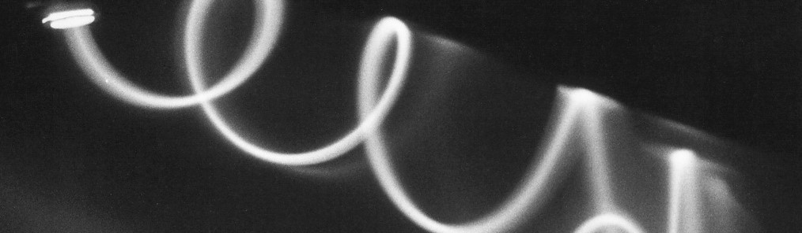

# Charge-to-mass ration of the electron

{: .center}

This experiment uses a kinematic analysis of the helical path followed by electrons deflected by a magnetic field to determine the ratio of their electrical charge $e$ to their mass $m_e$. The ratio is determined by measuring the change in magnetic field required to keep an electron beam focused on a CRT screen as a function of different accelerating voltages (also known as Hoag’s method).

---

<figure markdown>
<a href = 'Legacy\e-m_notes.pdf'> <i class="fas fa-file-pdf fa-3x"></i> </a>
    <figcaption>Lab notes
    </figcaption>
</figure>

## Additional resources

<figure markdown>
<a href = 'Legacy\e-m_image.pdf'> <i class="fas fa-image fa-3x"></i> </a>
    <figcaption>Image of apparatus
    </figcaption>
</figure>

<figure markdown>
<a href = 'CRT-xray.jpeg'> <i class="fas fa-image fa-3x"></i> </a>
    <figcaption>X-ray of CRT
    </figcaption>
</figure>

--8<-- "includes/abbreviations.md"
