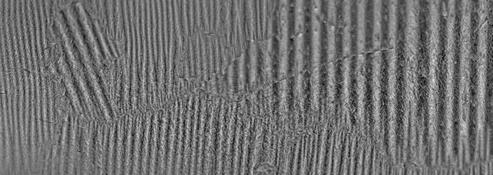

# Hysteresis of iron

{: .center}

Hysteresis in a physical system arises when the internal state of the system depends on the past history of external forces applied, i.e., the system does not return to its lowest-energy or equilibrium state in the absence of an applied force. This happens during the magnetisation of ferromagnetic material in an external field. In this experiment magnetic hysteresis in iron is explored as a function of the size of the magnetising current, and the energy dissipation due to hysteresis losses is explored.

---

<figure markdown>
<a href = 'Legacy/hysteresis_notes.pdf'> <i class="fas fa-file-pdf fa-3x"></i> </a>
    <figcaption>Lab notes
    </figcaption>
</figure>

## Experiment in a nutshell

In order to measure hysteresis in iron, one must first understand what is hysteresis. Expect to dedicate some time understanding exactly what is the phenomenon, with careful attention being applied to understanding how you might measure it. Once you are satisfied with what you are to measure:

* Know what you want to measure and plot. What are the axes of the plot? How are you going to record data, and how are you going to alter the independent variable?
* Construct the system in a piecewise manner: e.g. build a circuit that allows you to produce a variable current from a fixed current supply. Then send this variable current to your iron sample, then figure out how to reverse the direction of the current. Doing this is a step-by-step process will help you to understand the purpose of each component in the circuit.
* Research/discuss the basics of analogue-to-digital conversion and the implications of using a finite bit-depth over different voltage ranges.
* Use the degaussing circuit! If you do not know why this is important: learn why this is important!

This experiment commonly produces excellent results, but a bit of time and effort is required to learn to drive it.

## Additional resources

<figure markdown>
<a href = 'Legacy/Hysteresis_image.pdf'> <i class="fas fa-image fa-3x"></i> </a>
    <figcaption>Image of apparatus
    </figcaption>
</figure>

<figure markdown>
<a href = 'Legacy/extra notes.pdf'> <i class="fas fa-book-open fa-3x"></i> </a>
    <figcaption>Additional notes
    </figcaption>
</figure>

<figure markdown>
<a href = 'Legacy/Applications.pdf'> <i class="fas fa-book-open fa-3x"></i> </a>
    <figcaption>LM101-A application note
    </figcaption>
</figure>

<figure markdown>
<a href = 'Legacy/Power supply.pdf'> <i class="fas fa-book-open fa-3x"></i> </a>
    <figcaption>Power supply manual
    </figcaption>
</figure>

--8<-- "includes/abbreviations.md"
