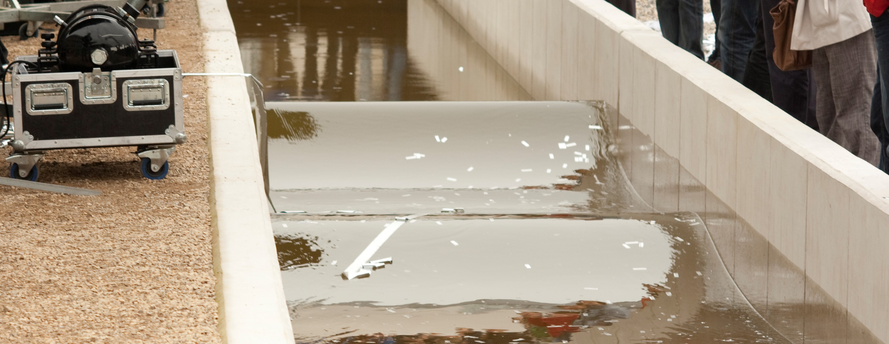

# Home

{: .center}

The part II labs are associated with 200-level subjects. Emphasis is placed on supervised independent investigation of non-trivial physical phenomena. Topics of investigation include foundational experiments in classical physics through to modern application-based experiments.

---

## Structure

Lab work is undertaken as part of subjects [KYA211](https://www.utas.edu.au/courses/cse/units/kya211-waves-and-kinetic-theory) *waves and kinetic theory* and [KYA212](https://www.utas.edu.au/courses/cse/units/kya212-electromagnetism-and-thermodynamics) *electromagnetism and thermodynamics* which run in semesters one and two respectively. Lab work accounts for 15% and 20% of the subject respectively, with the expectation that three and four labs will be completed in the respective subjects. Three hours of laboratory time is allocated each week during the semester; however, experiments are conducted over a two-week period. Experiments are conducted in collaboration with another student, but the program is designed to foster collaboration and to cultivate a collegiate environment amongst all participants.

### Current implementation

The text below is taken from the MyLO pages for KYA320 and KYA323, but, for the sanity of all involved, it is best to think of the lab program as a separate lab subject that operates in the background of the physics subjects that are currently being run. In short: as part of a physics major, you must complete 3 experiments and complete all [assessments]($assessments).

!!! abstract "Semester two, 2022"

    Experiments are a cornerstone of science, and during your second-year studies, you will undertake a series of experiments which allow one to probe at physical phenomena and hone your ability to employ the scientific method.

    Labs are conducted in pairs, and the primary mode of assessment will be your experimental logbook.

    All information for the lab program is hosted on the lab website, including the available experiments (and associated documentation), reference material for to aid in the execution of experiments and the preparation of materials to be assessed, along with general content such as FAQs and guides for usage of hardware, software, common coding tasks, and more.

    The part II labs are co-ordinated by the subject coordinator, and all enquiries should be directed to the physics lab mailbox.

    ---

    ## Summary

    You must complete three experiments for the semester. Each experiment involves the production of a logbook and additionally, at the end of the semester you must produce a formal lab report based on an experiment of your choice from the semester; this task includes a round of assessed peer assessment and a presentation.

    ## Schedule

    Labs will run in three blocks of labs, each lasting for three weeks. The dates for semester two, 2022 are as follows:

    Experiment block one: weeks 2, 3, and 4 (July 18th - August 5th), with logbooks to be submitted to the relevant dropbox (Monday and Wednesday) by 1300 on the day following your experiment
    Experiment block two: weeks 5, 6, and 7 (August 8th - August 26th), with logbooks to be submitted to the relevant dropbox (Monday and Wednesday) by 1300 on the day following your experiment
    Experiment block three: weeks 8, 9, and 10 (September 5th - September 23rd),
    with logbooks to be submitted to the relevant dropbox (Monday and Wednesday) by 1300 on the day following your experiment

    A final block is to be dedicated to scientific communication:

    Week 11: report preparation, submission for peer assessment by the end of Friday, September 30th
    Week 12: Peer assessment and editing, peer assessment feedback due by the end of Tuesday, October 4th, and final report submission by the end of Friday, October 7th
    Week 13: Lab report presentations, Monday October 10th and Wednesday October 12th
    Assessment

    The weighting of assessments for this semester is as follows:

    Experiment one (25%)
    Experiment two (25%)
    Experiment three (25%)
    Scientific communication: report (15%), presentation (5%), and peer assessment (5%)

    ---

    As soon as possible, you should:

    Sign-up to a laboratory session. Labs are run weekly, between 1300 - 1600 on Mondays and 1400 - 1700 on Thursdays. To confirm your attendance to a lab session, please enrol into in lab group here.
    Complete the Laboratory and Workshop Inductions 2022 module. In order to access a lab or workshop at UTAS, you must complete the Green-level induction within the Laboratory and Workshop Inductions 2022 module on MyLO. If this link shows 'not authorised', please go to MyLO home page (where all your units are listed) and use the Discover Course Catalogue tab on the top right of page. You should be able to search for, and enrol into the Laboratory and Workshop Induction 2022 unit.

    Upload the certificate. Following successful completion of the induction, you will be emailed a completion certificate (within 24 hours) which must be uploaded here.

    Note: if you have completed this induction for another subject in 2022, you can upload the same completion certificate.

    These tasks must be completed by the end of Friday July 16th

## Experiments

Over the course of the two subjects, it is expected that you will complete seven experiments. It is suggested that you pick experiments which interest you, but also across of range of subjects to ensure exposure to diverse content.

=== "KYA211: waves and kinetic theory"

    | Experiment | Branch(es) of physics | Summary | Difficulty  |
    | :-----: | :-----| :----- | :-----: |
    | [Adiabatic index of gasses](adiabatic) |	Kinetic theory | The period of a ball bearing undergoing lightly-damped, forced oscillations due to pressure variations in a gas reservoir is observed as a way to evaluate the adiabatic index $\gamma$ of the gas. $\gamma$ is a fundamental thermodynamic property of gases that according to theory must take values equal to the ratio of two integers for mono-, di-, and tri-atomic gases. Argon, dry air (O$_2$ $+$ N$_2$), and CO$_2$ are used as examples of the three types. $\gamma$ is related to the compressibility, the sound speed, and the heat capacity of a gas. | :material-star: :material-star: :material-star-outline: |
    | [Electron diffraction](ediffraction) | Wave mechanics, Quantum physics | A thin piece of highly-ordered material is considered as a diffraction screen with aperture spacings determined by the atomic spacings in the sample. Observations of the patterns that result when electrons accelerated through several kilovolts hit a chip of graphite can be used to prove that electrons can exhibit wave behaviour in accordance with deBroglie's hypothesis, and to probe the spacing and arrangement of graphite atoms on scales $\lesssim$10$^{-9}$ m. | :material-star: :material-star-half-full: :material-star-outline: |
    | [Time-domain reflectometry](TDR) |	Wave mechanics, Electromagnetism | The properties of waveforms travelling through cables with different characteristic impedances are investigated. The behaviour of reflected waves from boundaries of high, low, and matched impedance is observed and related to the wave equation, and the characteristic impedance and speed of pulses in a cable are used to compare the cable inductance and capacitance to theoretically calculated values. | :material-star: :material-star-outline: :material-star-outline: |
    | [Ultrasonic ranging](ultrasound) | Wave mechanics | This experiment looks into some of the problems involved in using ultrasonic sound waves to measure the distance of an object from an ultrasonic transmitter. | :material-star: :material-star-half-full: :material-star-outline: |

=== "KYA212: electromagnetism and thermodynamics"

    | Experiment | Branch(es) of physics | Difficulty |
    | :-----: | :-----| :-----: |
    | Charge-to-mass ration of the electron |	Electromagnetism | :material-star: :material-star-half-full: :material-star-outline: |
    | Entropy change in a rubber band |	Thermal physics | :material-star: :material-star-half-full: :material-star-outline: |
    | Hysteresis of iron |	Electromagnetism | :material-star: :material-star-half-full: :material-star-outline: |
    | Induction and the Earth's magnetic field |	Electromagnetism | :material-star: :material-star-half-full: :material-star-outline: |
    | The Michelson interferometer |	Wave mechanics, optics | :material-star: :material-star-half-full: :material-star-outline: |

=== "KYA---: under development"
    | Experiment | Branch(es) of physics | Summary | Difficulty  |
    | :-----: | :-----| :----- | :-----: |
    | Fourier optics | Wave mechanics, Optics | | :material-star-outline: :material-star-outline: :material-star-outline: |
    | The Frank-Hertz experiment | Quantum mechanics | | :material-star-outline: :material-star-outline: :material-star-outline: |
    | The Mach-Zehnder interferometer | Wave mechanics, Optics | | :material-star-outline: :material-star-outline: :material-star-outline: |
    | Holography |	Wave mechanics, Optics | | :material-star-outline: :material-star-outline: :material-star-outline: |

Prior to performing any experiments, it is a requirement that you have completed the [lab induction](../safety/inductions/).

## Assessment
As part of each experiment, you will be expected to maintain an experimental logbook upon which you will be assessed. Log books are to be written _during_ practical sessions, with the expectation that the vast majority - ideally the entirety - of the work will be completed during the allocated classes. Reports are required to be submitted by 1300 the day after your final lab session for a given experiment. Your logbook will be returned prior to your next experiment, and part of your assessment will be based upon how you address your markers comments.

In addition to your logbook, once per semester you will be required to select one of the completed experiments and prepare a formal report and to give a short group presentation.

Information on how to prepare, and what is expected for a log, a report and a presentation can be found in the [reference section of POLUS](../reference/experiment/#communication).

## Practicalities
Labs take place in the part II lab (room 233) in the [mathematics and physics building](https://www.openstreetmap.org/way/23959304) located on the Sandy Bay campus.

--8<-- "includes/abbreviations.md"
