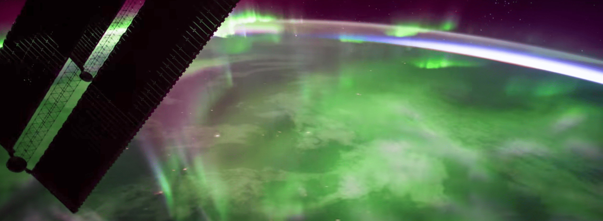

# Induction and the Earth's magnetic field

{: .center}

A changing magnetic flux creates a measurable electric current in a loop of wire. One way of creating a change in magnetic flux is by changing the orientation of the loop with respect to a constant field $\mathbf{B}$. In this experiment, the strength and orientation of the Earth’s magnetic field is measured by observing the electrical response produced during a $180^{\circ}$ rotation of a coil of wire (known as the _$\pi$-flipper_). Because the Earth’s magnetic field is relatively weak, an op-amp circuit is used to amplify the signal.

---

<figure markdown>
<a href = 'Legacy\induction_notes.pdf'> <i class="fas fa-file-pdf fa-3x"></i> </a>
    <figcaption>Lab notes
    </figcaption>
</figure>

## Additional resources

<figure markdown>
<a href = 'Legacy\induction_image.pdf'> <i class="fas fa-image fa-3x"></i> </a>
    <figcaption>Image of apparatus
    </figcaption>
</figure>

<figure markdown>
<a href = 'Legacy\B and W charts NSW Vic Tas.pdf'> <i class="fas fa-book-open fa-3x"></i> </a>
    <figcaption>Magnetic field charts for New South Wales, Victoria, and Tasmania
    </figcaption>
</figure>

<figure markdown>
<a href = 'Legacy\Geomagnetic fields horizontal.docx'> <i class="fas fa-book-open fa-3x"></i> </a>
    <figcaption>Horizontal intensity of the Earth's magnetic field
    </figcaption>
</figure>

<figure markdown>
<a href = 'Legacy\Magnetic fields vertical.docx'> <i class="fas fa-book-open fa-3x"></i> </a>
    <figcaption>Vertical intensity of the Earth's magnetic field
    </figcaption>
</figure>

<figure markdown>
<a href = 'Legacy\Resistor Colour Codes.pdf'> <i class="fas fa-book-open fa-3x"></i> </a>
    <figcaption>Information on resistor colour codes
    </figcaption>
</figure>

--8<-- "includes/abbreviations.md"
