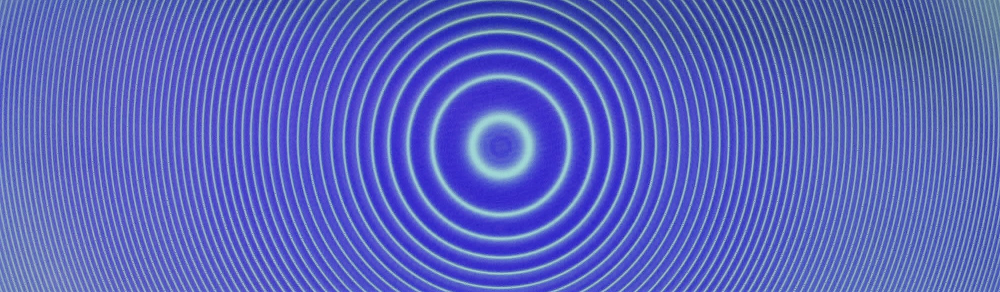

# The Michelson interferometer

{: .center}

The wave nature of light at visible wavelengths is demonstrated by use of a dual-beam interferometer of the sort pioneered by Michelson. By altering the optical path length of one beam relative to the other, interference effects are used to measure the index of refraction of mica and of air over a range of pressures.

---

<figure markdown>
<a href = 'Legacy\Michelson_notes.pdf'> <i class="fas fa-file-pdf fa-3x"></i> </a>
    <figcaption>Lab notes
    </figcaption>
</figure>

## Experiment in a nutshell

Interferometers are highly-sensitive devices, and provide a low-barrier entry into precision measurement. The price of admission is they are extremely sensitive: they are fiddly! The purpose of this experiment is to understand how one can use an interferometer to measure phase differences between the arms of an interferometer, which involves:
* Investigating the interferometer. You will need to spend some time understanding the fundamentals of an interferometer. You will know that you are prepared to tackle some measurements once you can explain:
    * The shape/form of the interference pattern
    * You know how to determine when the lengths of the interferometer arms are the same

The task then is to observe interference, and understand how to alter the interference pattern through adjustments to the alignment. Some important considerations:
* The alignment of optical systems can be hard! It often involves iteration, and a given procedure may not converge, so be prepared to put in some work. Fortunately, your skills in this area will improve, so an alignment that initially took a long time can be reduced to seconds with practice.
* The micrometer has a gearing system: you will need to calibrate the distance travelled by the mirror and the adjustment to the micrometer
* You should now be able to measure _phase objects_: if you have a balanced interferometer and then insert a phase object into an arm, you should be able to quantify the change in phase that is introduced by that object by adjusting the length of one the interferometer arms. Importantly, to extract meaningful information from this process, you will need to have a relationship between the phase change introduced by the object and the distance travelled by the mirror, and it is worthwhile to have this sorted before trying to make any quantitative measurements

## Additional resources

<figure markdown>
<a href = 'Legacy\Michelson_image.pdf'> <i class="fas fa-image fa-3x"></i> </a>
    <figcaption>Image of apparatus
    </figcaption>
</figure>

<figure markdown>
<a href = 'Legacy\Fundamentals of Optics.pdf'> <i class="fas fa-book-open fa-3x"></i> </a>
    <figcaption>Fundamentals of Optics
    </figcaption>
</figure>

<figure markdown>
<a href = 'Legacy\Beck interferometer.pdf'> <i class="fas fa-book-open fa-3x"></i> </a>
    <figcaption>Beck interferometer manual
    </figcaption>
</figure>

--8<-- "includes/abbreviations.md"
