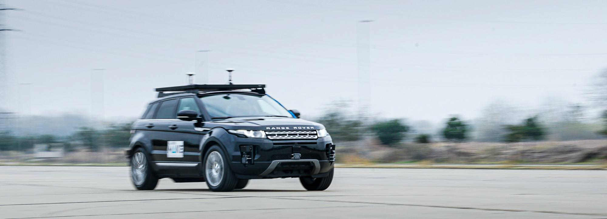

# Ultrasonic ranging

{: .center}

This experiment looks into some of the problems involved in using ultrasonic sound waves to measure the distance of an object from an ultrasonic transmitter.

---

## Introduction

\subsection{Summary}

\input{Ultrasonic/Ultrasonic_summary}

\subsubsection*{Objectives}

\begin{enumerate}
\item To observe and record time lap between signal transmitted and signal received.

\item To measure speed of sound in air at two different temperatures.

\item To estimate effects of temperature and humidity on speed of sound in air.
\end{enumerate}

\subsubsection*{Equipment}

The basic equipment is simple, consisting of an ultrasonic transmitter  and a  receiver, an Arduino Uno board to drive the transmitter, an amplifier attached to the receiver, and an oscilloscope for measuring the travel time of a burst of ultrasonic waves.  You will control the transmitted  signal from the Arduino using very simple code which is based on the C/C++ language.
Some technical information on the ultrasonic transducers (probably more than you want to know!) is in an information folder on the equipment trolley. There are myriad  Arduino resources online.
Both transmitter and receiver have been mounted inside plastic tubes.  Since you will want to know the exact positions of the transmitting and receiving surfaces inside the tubes, we have engraved grooves on the outside of the tubes, in the correct positions.  Please do not poke anything down either tube.

\subsubsection*{Principal Data Taken}
\begin{enumerate}
\item Time delay between sending and receiving a signal versus the distance travelled.

\item Temperature and humidity of the ambient air.

\end{enumerate}

\subsubsection*{Things to Watch Out For}

\begin{itemize}
\item The bench set up for this experiment is mobile, as you will need to vary the distance between sender and receiver. However, you will need to have power, so beware of cables on the floor and other students in the laboratory.

\item Transducers, Arduino board, oscilloscope and computer are all already wired up. There is no need for you to connect or disconnect anything.
\end{itemize}

\subsection{Setting Up the Transducers}

The transducers are designed to operate at about 40 kHz.  It is advantageous, however, to  "fine tune"  your pair so that they are operating at peak efficiency.

Switch on the signal generator, and place transmitter and receiver facing each other less than a metre apart.  Make sure that the transmitter is connected to the signal generator and that the receiver is connected to its amplifier (small metal box), which must be powered up.  Use the  C.R.O. to observe the amplifier output.

Boot up the computer, and start the Arduino IDE. Load the file called tone\_pin8.ino. The file should be located at "C:\textbackslash\textbackslash Users\textbackslash Public \textbackslash Public Documents \textbackslash Ultrasonic \textbackslash tone\_pin8.ino".

This file has comments next to the commands which should explain what each one does.
In the preamble variables are defined: FREQ in Hertz, duty and period in microseconds.
\begin{itemize}
	\item {\it FREQ} allows you to set the frequency of the ultrasound emitted. Edit the value to about 40 kHz.
	\item {\it duty} or duty cycle, sets how long each ultrasonic pulse lasts.
	\item {\it period} sets the time between the  pulses.
\end{itemize}

The "setup" section configures the hardware on the board, the "loop" section has commands which are repeated endlessly.

Save the file (shortcut; ctrl-s). The new parameters are loaded on the board by  uploading the sketch file to the Arduino, (shortcut; ctrl-u).

Experiment with values of {\it duty} and {\it period} to familiarise your self with what they represent. Now alter frequency until you find value which gives the maximum receiver output amplitude - and write it down in your lab notes!

The transducers are now "tuned".

\subsection{Introductory Experiment}

Move the equipment trolley to a position about 1 metre from a smooth wall, or even better, a large pane of glass.   Arrange the transmitter and receiver to be equidistant from the wall, one on either side of the sound absorbing screen.  Use whatever simple tests you can devise to satisfy yourself that the receiver is indeed detecting a signal reflected off the wall.

Just observing the reflected signal tells you nothing about the travel time of a particular wavefront from transmitter to wall and back, because all wavefronts are identical.
Devise a means of measuring the travel time of the leading wave front of a particular burst of ultrasound.  You will need to think carefully about what the trigger controls on the C.R.O. do, and about the significance of the various modes of trigger operation.
It may also help to consider the following questions :

\begin{itemize}
	\item Roughly how long, in milliseconds, will it take the first wave front of a burst to travel to the wall and back?
	\item During this time, what will the output of the receiver be?
	\item How can you trigger a sweep of the C.R.O. at the instant that you start a burst of ultrasound?
\end{itemize}

You will also need to consider the period of the ultrasound bursts.  Does your next burst from the transmitter occur  before the reflection arrives at the receiver, confusing the temporal association of the transmitted with the reflected burst?
Observe the time between your burst of ultrasound and the reflection. Is your prediction of travel time confirmed?
You should discuss in your report how you confirmed that the time measurement taken was indeed for the same burst.

The transmitter doesn't perform optimally  when it is fed with a chopped sine wave and the amplitude of the sine wave is rather large at around 5V.  Zoom in on the oscilloscope and look at the  ~40 kHz waveform from the Arduino. The reflected signal isn't an exact copy,  something akin to ringing is occurring in the transmitter, in addition to dispersion in the air and by the reflecting surface.

Note that a certain amount of ultrasound penetrates through and diffracts around the sound-proof screen, so that the received signal is not zero during the "off" periods.  By moving the transmitter and receiver about you should be able to minimise this unwanted signal.

\subsection{Procedure}
Using your setup, which should now be optimally tuned, you will measure the velocity of sound in the air  and investigate its dependence on the temperature and humidity of the air in which it propagates.

\begin{enumerate}
\item You now have a sort of sonar apparatus. Set it up so that the sound emitted reflects directly back to the receiver. Measure the transit distance using the measuring tape provided. Note that the groove on the transducer tube can be used to ascertain the position of the transducer in the tube. {\it Do not stick measuring tape inside the tube.} Measure transit time from the oscilloscope. Repeat the measurements over as wide a range of transmitter-to-wall distances as possible. You will plot a graph from this data and fit a linear function to it. You should be able to measure out to about 4-5 metres from the reflecting surface.

\item Before and after your observations  you should make some meteorological observations.  On the trolley you should find a digital thermometer and humidity instrument, so keep a record of these values (it can be programmed to sample and record these values, it has a USB interface for communication) . One meteorological observation we are {\it not} asking you to make is a measurement of the barometric pressure.  Why not?

\item You should take a set of readings in a cold dark room for example, and another set in a warm environment, where the ambient temperatures differ as much as possible. A set of readings on a different day with different humidity would also be instructive.

\end{enumerate}

\subsection{Calculations}

Having done all the above, you can now consider analysing your transit time measurements.

First consider the following possible source of error.  The oscilloscope time-base may be inaccurate.  The calibration of time-base speeds around 1 ms. per cm. can be checked by feeding the C.R.O. with a wave of accurately known frequency and comparing its period with the period indicated on the C.R.O. screen. The Rhodes and Schwarz SMX signal generator in Lab 2 is a quality reference instrument. (This error applies more to the old analogue oscilloscopes, rather than the digital models, but worth checking). If a correction is necessary make sure that you get it the right way round; it is easy to make a mistake.

Plot transit time versus distance.  (The free R statistical software, or perhaps Python, are to be preferred over Excel, if you wish to become familiar with scientific grade tools)  Use your graph or software to calculate the speed of sound.  (This is rather a back to front approach for a ranging experiment.  In practice one would measure the transit time and calculate the distance using an assumed speed of sound, but we are concerned with variations in the speed.)

Remember to note estimates of distance and time measurement errors, as well as temperature and  humidity error. These will contribute to an error in velocity. (Once again R has excellent tools for these kinds of calculations.)

Carefully read the section in Kaye and Laby1 on the speed of sound in air.  A diagram from a paper by Harris2 is included with these notes.  (A copy of the complete paper is in the information folder.)
The Handbook of Chemistry and Physics3 contains some useful tables too.  What meteorological parameters particularly affect the speed of sound in air?

Use your meteorological observations and the information in Kaye and Laby or elsewhere to estimate the speed of sound in your work area during your experiment.  How does it compare with the value you obtain?

Alternatively, start with your value of velocity and correct it to  0$^{\circ}$C and zero humidity.  How does this compare with the book value? How many standard deviations (from your error estimate) is your value from the theoretical?

\subsection{Questions to Address in the Report}
\begin{enumerate}
\item With reference to the expression for speed of sound in any gas, show why pressure is not important in determining the speed of sound; by using the value for the gas constant R and the molecular mass of dry air, derive an expression for the speed that only depends on temperature.

\item Especially concerning humidity , you could discuss the composition of air in terms of monatomic, diatomic and triatomic  molecules,  and how this affects the gamma value; the ratio of the specific heat of gas at constant pressure,  to that at constant volume.  How does the  percentage of water molecules in the air affect the molecular mass?

\item What is the effect of audio frequency on the speed of sound?

\item What are the relative magnitudes of the the effects of temperature and humidity?
\end{enumerate}

\vspace{18pt}

\noindent{\bf References}\\
\noindent Kaye and Laby, Tables of Physical and Chemical Constants, 14th Ed., Longman, London.\\[5pt]

\noindent Harris, C.M., 1971,  Effects of Humidity on the Velocity of Sound in Air, Journal of the 	Acoustical Society of America, Vol. 49, pp. 890 - 893.	\\[5pt]

\noindent Handbook of Chemistry and Physics, 55th Ed. (or thereafter),1974, 	CRC Press, Ohio.\\[5pt]

\noindent	Dennis A. Bohn, Environmental effects on the Speed of Sound,  J. Audio Eng. Soc., Vol. 36, No. 4, 1988 April (and references therein)\\[5pt]

[^1]: N. A. me, _Title_, (Publisher, location, year) [page]

--8<-- "includes/abbreviations.md"
