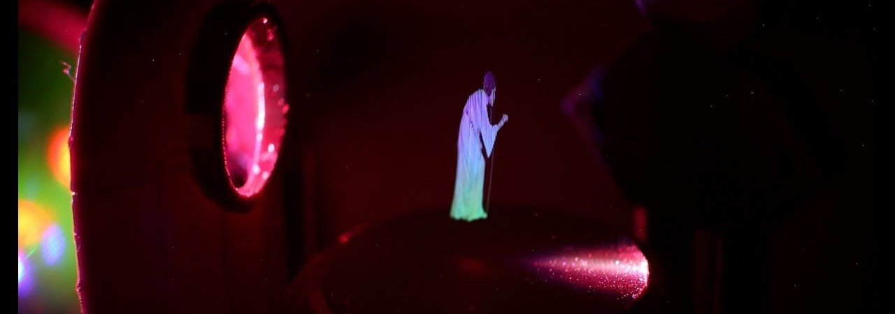

# Home

{: .center}

The part III labs are associated with 300-level subjects. Emphasis is placed on self-directed learning and solving problems in the context of an extended investigation. Topics of investigation include atomic physics, nuclear & particle physics, electromagnetism, and optics.

---

## Structure

Lab work is undertaken as part of the core third-year physics subjects [KYA321](https://www.utas.edu.au/courses/cse/units/kya321-wave-mechanics-and-quantum-mechanics) *wave mechanics and quantum mechanics* and [KYA320](https://www.utas.edu.au/courses/cse/units/kya320-advanced-electromagnetism) *advanced electromagnetism* which run in semesters one and two respectively, in addition to the biennial [KYA322](https://www.utas.edu.au/courses/cse/units/kya322-statistical-physics-and-solid-state-physics?year=2022) *statistical physics and solid-state physics* and [KYA323](https://www.utas.edu.au/courses/cse/units/kya323-atomic-and-nuclear-physics) *atomic and nuclear physics* courses. In all cases, lab work accounts for 25% of the subject mark and 36 hours of laboratory time is allocated for the semester. In actuality, experiments are conducted over a two-week period, with each experiment accounting for 16 contact hours. Experiments are conducted in collaboration with another student, but the program is designed to foster collaboration and to cultivate a collegiate environment amongst all participants. Experiments are undertaken according to a flexible schedule, with access organised on an ad-hoc basis, with the exception being a weekly mandatory discussion session, which will be used to plan and discuss experiments, technical aspects of experimental science, and give "whiteboard" presentations.

### Current implementation

The text below is taken from the MyLO pages for KYA320 and KYA323, but, for the sanity of all involved, it is best to think of the lab program as a separate lab subject that operates in the background of the physics subjects that are currently being run. In short: as part of a physics major, you must complete 3 experiments and complete all [assessments]($assessments).

!!! abstract "Semester two, 2022"

    Experiments are a cornerstone of science, and during your third-year studies, you will undertake a series of experiments which allow one to probe at complex phenomenon and build your ability to employ the scientific method.

    Labs are conducted in pairs, and the primary mode of assessment will be your experimental logbook, with a hurdle requirement being that you provide a brief presentation for each experiment.

    All information for the lab program is hosted on the [lab website](../), including the [available experiments](#experiments) (and associated documentation), [reference material](../reference/experiment/) for to aid in the execution of experiments and the preparation of materials to be assessed, along with general content such as FAQs and guides for usage of hardware, software, common coding tasks, and more.

    Labs are co-ordinated by Andy McCulloch, and all enquiries should be directed to the [physics lab mailbox](mailto:physics.labs@utas.edu.au).

    ---

    ## Summary

    You must complete *two experiments* for the semester. Each experiment involves the production of a logbook and has a hurdle requirement of an informal presentation. Additionally, you must produce a formal lab report based on an experiment of your choice from any time in the year; this task includes a round of assessed peer assessment and a presentation.

    ## Schedule

    Labs will run in three _blocks_ of labs, each lasting for three weeks. The dates for semester two, 2022 are as follows:

    Experiment block one: weeks 2, 3, and 4 (July 18th - August 5th), with logbooks to be submitted to the block one dropbox by the end of Friday, August 5th
    Experiment block two: weeks 5, 6, and 7 (August 8th - August 26th), with logbooks to be submitted to the block two dropbox by the end of Friday, August 26th
    Experiment block three: weeks 8, 9, and 10 (September 5th - September 23rd), with logbooks to be submitted to the block three dropbox by the end of Friday, September 23rd

    During each block, whiteboard presentations are to be undertaken during the common lab session (Monday, 0900 - 1200 in the part III lab) in second week of the block, or explicitly:

    Experiment block one: Monday July 25th
    Experiment block two: Monday August 15th
    Experiment block three: Monday September 12th

    IT IS A REQUIREMENT THAT ALL STUDENTS ATTEND ALL PRESENTATION SESSIONS, EVEN IF YOU ARE NOT CONDUCTING AN EXPERIMENT DURING THE BLOCK

    A final block is to be dedicated to scientific communication:

    Week 11: report preparation. Submission for peer assessment to the relevant dropbox by the end of Friday, September 30th
    Week 12: Peer assessment and editing. Peer assessment feedback due for submission to the appropriate dropbox by the end of Tuesday, October 4th, and final report to be submitted to the dropbox by the end of Friday, October 7th
    Week 13: Lab report presentations. Presentations are to take place in the final common session, on Monday, October 10th.
    Assessment

    The weighting of assessments for this semester is as follows:

    Experiment one (30%)
    Experiment two (30%)
    Scientific communication: report (20%), presentation (10%), and peer assessment (10%)

## Experiments

Over the course of the two subjects, it is expected that you will complete five experiments. It is suggested that you pick experiments which interest you, but also across of range of subjects to ensure exposure to diverse content.

=== "Current experiments"

    | Experiment | Branch(es) of physics | Summary |
    | :-----: | :-----| :----- |
    | [$γ$-ray spectroscopy](gamma) |	Nuclear physics | This experiment explores $\gamma$ radiation, investigating the interaction between $\gamma$ rays and matter, and applying this understanding to the identification of unknown materials. |
    | [The lifetime of the muon](muon) |	Particle physics | Muons are naturally occurring subatomic particles that originate from the interaction between cosmic rays and atmospheric nuclei. In this experiment muons are captured into an absorber, and then the rate of muon radioactive decay is measured using a scintillation detector. From the rate of decays, the half-life of the muon can be determined. |
    | [Microwave waveguides](waveguides) |	Electromagnetism | The aim of this experiment is to measure the characteristics of a section of waveguide and subsequently examine the reflection, transmission and adsorption due to an obstacle placed in the guide. |
    | [Nuclear magnetic resonance](nmr) |	Atomic physics, quantum mechanics | Magnetic Resonance Imaging (MRI) is a powerful tool in modern healthcare. This experiment examines the underlying physics, allowing students to investigate the magnetic field characteristics required, and measure the spin relaxation times of a sample (mineral oil). |
    | [The production and characterisation of X-rays](xray) | Atomic physics | Atoms bombarded by electrons with energies on the order of 10-100 keV are observed to produce X-rays by the Bremsstrahlung mechanism, and also through ionization from inner shell energy levels. In this experiment a Geiger-Müller tube is used to detect the characteristic X-rays produced by a copper sample. Scattering these X-rays through a lithium fluoride crystal allows the student to measure the energy dispersion of these X-rays. |
    | [Scattering of $\alpha$ radiation](alpha) | 	Nuclear physics | Students test the angular dependence of scattering for gold, silver and aluminium foil. They may also measure the energy distribution of pulses from the silicon semiconductor detector in order to investigate the source spectrum and energy resolution of the detector. The experiment provides an introduction to the techniques of energy measurement for fast charged particles, the use of pulse height analysis and vacuum systems. It also increases awareness of statistical problems associated with nuclear measurements. |
    | [Solar spectroscopy](solar) | 	Astrophysics, optics | Students obtain digital Solar spectra through the whole visual region and use these to identify all strong lines and their species, together with undertaking a particular study of the violet resonance lines of ionized calcium to estimate the calcium abundance in the Sun. |
    | [The Zeeman effect in Mercury](zeeman) |	Atomic physics, optics, quantum mechanics | The anomalous Zeeman splitting of the green line of mercury is observed using a Fabry-Perot Interferometer. The value of the Bohr magneton is obtained and the polarization of the line is studied. The experiment complements the lectures on the Zeeman effect and gives experience in the measurement of magnetic fields and in high-resolution spectroscopy. |

=== "Experiments under development"
    | Experiment | Branch(es) of physics | Summary |
    | :-----: | :-----| :----- |
    | [Atomic force microscopy](afm) | Quantum mechanics, Optics |
    | Optical tweezers | Optics, statistical mechanics |

### Experiment selection

The selection process is a combination of research, that is, having a look through the experiments as they are listed above (especially at the flavour profiles as listed on the experiment pages) and also attending the first common lab session, during which time we will discuss practicalities of the lab program, but you will also be able to have a look at the experiments and informally discuss with the academics responsible for the labs over energy dense foods. Details will be circulated about the event near the commencement of labs.

Once you have decided on your preference for experiments, get in contact with the coordinating academic (listed on individual experiment webpages) and they will coordinate things from there, providing you with information about the running of the experiment and conducting an individual experiment induction. Before you undertake your experiment, ensure that you have completed the [induction checklist](../safety/inductions/#checklist)

## Assessment
As part of each experiment, you will be expected to maintain an experimental logbook upon which you will be assessed. There is also a hurdle requirement that for each experiment you will give a short "whiteboard" presentation to your peers about your experiment to your peers. Additionally, once per semester you are required to prepare a formal report on one experiment, which will include a peer assessment process.

=== "Semester one"
    | Task | Weighting | Due date |
    | :-----: | :-----| :----- |
    | [Logbook #1](#experimental-logbooks) | $80%$ |
    | [Whiteboard presentation #1](#whiteboard-presentations) | Hurdle |
    | [Pop-science pitch](#popular-science-pitch) | $20%$ |

=== "Semester two"
    | Task | Weighting | Due date |
    | :-----: | :-----: | :----- |
    | [Logbook #2](#experimental-logbooks) | $30%$ |
    | [Whiteboard presentation #2](#whiteboard-presentations) | Hurdle |
    | [Logbook #3](#experimental-logbooks) | $30%$ |
    | [Whiteboard presentation #3](#whiteboard-presentations) | Hurdle |
    | [Report](#report): peer assessment/submitted | $10%/20%$ | Week 12 |
    | [Presentation](#presentations) | $20%$ | Week 13 |

### Experimental logbooks

Information on how to prepare, and what is expected for a log can be found in the [reference section of POLUS](../reference/experiment/#log-books).

### Whiteboard presentations

The cohort of people undertaking the third-year lab program is small, and is ripe for collaboration and discussion. Moreover, succinctly communicating complex ideas is a critically important part of the scientific endeavour. It is for these reasons an informal presentation, which is not assessed but is a hurdle requirement for the completion of each lab, will be given by each lab group to the rest of the lab cohort during the common session. It is expected that you will provide an overview of the experiment: what is the relevant physics, what are you going to measure and how are you going to measure it, and how will your analysis take place. This is not meant to be an imposition, but rather a process to reflect, solidify understanding and communicate openly with a group of interested people.

### Popular-science pitch
Information on how to prepare, and what is expected for a Popular-science pitch can be found in the [reference section of POLUS](../reference/experiment/#popular-science-pitch).

### Lab reports
Information on how to prepare, and what is expected for a lab report can be found in the [reference section of POLUS](../reference/experiment/#reports).

### Presentations
Information on how to prepare, and what is expected a presentation can be found in the [reference section of POLUS](../reference/experiment/#presentations).

## Practicalities
Prior to performing any experiments, it is a requirement that you have completed the [lab induction](../safety/inductions/).

Labs take place in one of the part III labs (rooms 140, 231, 233) in the [mathematics and physics building](https://www.openstreetmap.org/way/23959304) located on the Sandy Bay campus. Common sessions will be held in the part II/III lab (233), which you are welcome to attend (and encouraged to attend) at your leisure.

--8<-- "includes/abbreviations.md"
