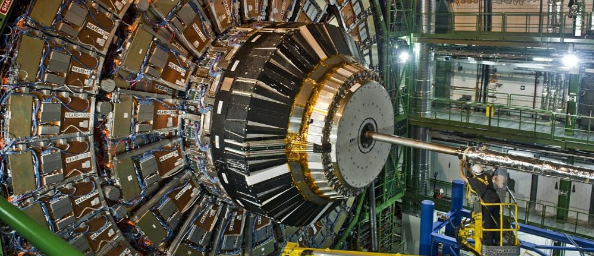

# The lifetime of the muon

Muons are naturally occurring subatomic particles that originate from the interaction between cosmic rays and atmospheric nuclei. In this experiment muons are captured into an absorber, and then the rate of muon radioactive decay is measured using a scintillation detector. From the rate of decays, the half-life of the muon can be determined

!!! info "Practicalities"

    === "Flavour profile"

        | Taste | Rating |
        | ----------- | :------------------------------------: |
        | Electronics, signal processing, etc. | :material-star: :material-star: :material-star-half-full: |
        | Computation: simulation, analysis, etc. | :material-star: :material-star-half-full: :material-star-outline: |
        | Dexterous experimentation | :material-star: :material-star-outline: :material-star-outline: |

    === "Academic contact"

        <figure markdown>
        <a href="mailto:physics.labs@utas.edu.au"><i class="fas fa-at fa-5x"></i></a>
        <figcaption><a href="https://www.utas.edu.au/profiles/staff/cose-natural-sciences-physics/">TBD</a></figcaption>
        </figure>

    === "Location"

        The experiment takes place in the Part III lab (Room 233, Physics building SB.AU.14, Sandy Bay)

---

## Content

--8<-- "includes/abbreviations.md"
