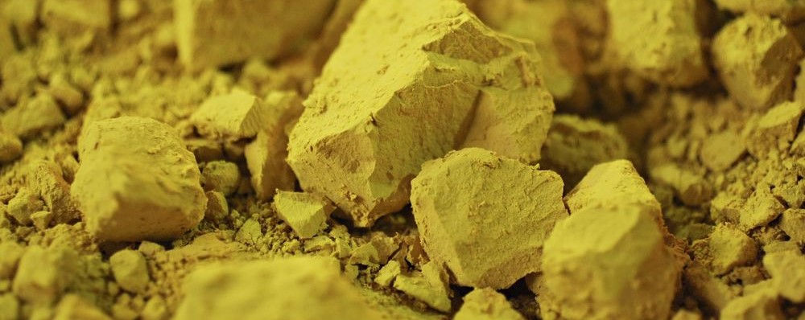

# Nuclear magnetic resonance

Magnetic Resonance Imaging (MRI) is a powerful tool in modern healthcare. This experiment examines the underlying physics, allowing students to investigate the magnetic field characteristics required, and measure the spin relaxation times of a sample (mineral oil).

!!! info "Practicalities"

    === "Flavour profile"

        | Taste | Rating |
        | ----------- | :------------------------------------: |
        | Electronics, signal processing, etc. | :material-star-outline: :material-star-outline: :material-star-outline: |
        | Computation: simulation, analysis, etc. | :material-star: :material-star-outline: :material-star-outline: |
        | Dexterous experimentation | :material-star: :material-star-outline: :material-star-outline: |

    === "Academic contact"

        <figure markdown>
        <a href="mailto:Krzysztof.Bolejko@utas.edu.au"><i class="fas fa-at fa-5x"></i></a>
        <figcaption><a href="https://www.utas.edu.au/profiles/staff/cose-natural-sciences-physics/">Krzysztof Bolejko</a></figcaption>
        </figure>

    === "Location"

        The experiment takes place in the Part III lab (Room 233, Physics building SB.AU.14, Sandy Bay)

---

## Content

<figure markdown>
<a href = 'NMRnotes.pdf'> <i class="fas fa-file-pdf fa-3x"></i> </a>
    <figcaption>Lab notes
    </figcaption>
</figure>

## Additional resources

<figure markdown>
<a href = 'https://www.phywe.com/biology/modern-imaging-methods-in-biology/magnetic-resonance-imaging-mri-i_9259_10190/'> <i class="fas fa-globe fa-3x"></i> </a>
    <figcaption>Manufacturer's webpage
    </figcaption>
</figure>

<figure markdown>
<a href = 'QS2018AJM.pptx'> <i class="fas fa-book-open fa-3x"></i> </a>
    <figcaption>Notes from a course on quantum systems with some detail on NMR and MRI
    </figcaption>
</figure>

--8<-- "includes/abbreviations.md"
