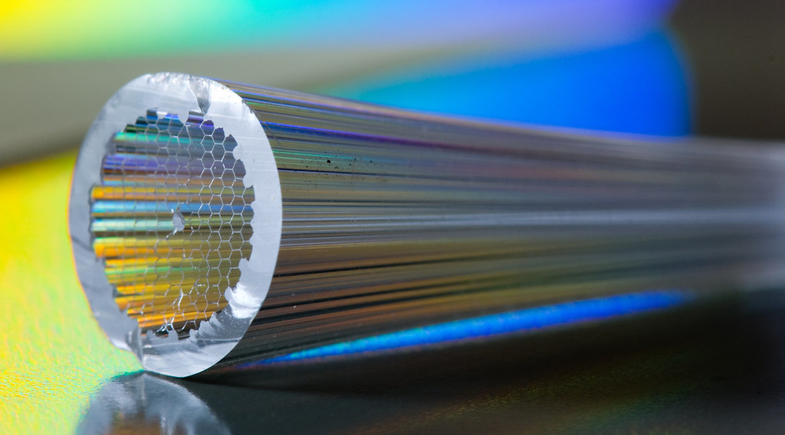

# Microwave waveguides

The aim of this experiment is to measure the characteristics of a section of waveguide and subsequently examine the reflection, transmission and adsorption due to an obstacle placed in the guide.

!!! info "Practicalities"

    === "Flavour profile"

        | Taste | Rating |
        | ----------- | :------------------------------------: |
        | Electronics, signal processing, etc. | :material-star: :material-star-outline: :material-star-outline: |
        | Computation: simulation, analysis, etc. | :material-star: :material-star-outline: :material-star-outline: |
        | Dexterous experimentation | :material-star: ::material-star-outline: :material-star-outline: |

    === "Academic contact"

        <figure markdown>
        <a href="mailto:Simon.Ellingsen@utas.edu.au"><i class="fas fa-at fa-5x"></i></a>
        <figcaption><a href="https://www.utas.edu.au/profiles/staff/cose-natural-sciences-physics/simon-ellingsen">Simon Ellingsen</a></figcaption>
        </figure>

    === "Location"

        The experiment takes place in the Part III lab (Room 233, Physics building SB.AU.14, Sandy Bay)

{: .center}

---

<figure markdown>
<a href = 'waveguide_description.pdf'><i class="fas fa-file-pdf fa-3x"></i> </a>
    <figcaption>Lab notes
    </figcaption>
</figure>

## Additional resources

--8<-- "includes/abbreviations.md"
