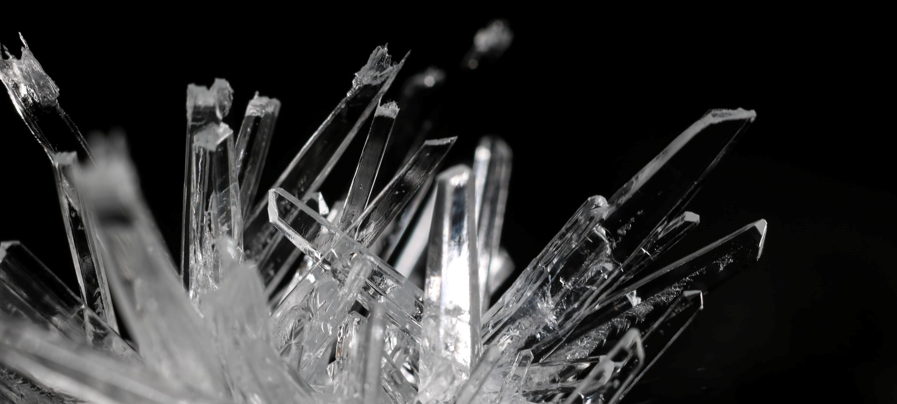

# The production and characterisation of X-rays

Atoms bombarded by electrons with energies on the order of 10-100 keV are observed to produce X-rays by the Bremsstrahlung mechanism, and also through ionization from inner shell energy levels. In this experiment a Geiger-Müller tube is used to detect the characteristic X-rays produced by a copper sample. Scattering these X-rays through a lithium fluoride crystal allows the student to measure the energy dispersion of these X-rays.

!!! info "Practicalities"

    === "Flavour profile"

        | Taste | Rating |
        | ----------- | :------------------------------------: |
        | Electronics, signal processing, etc. | :material-star-half-full: :material-star-outline: :material-star-outline: |
        | Computation: simulation, analysis, etc. | :material-star: :material-star-outline: :material-star-outline: |
        | Dexterous experimentation | :material-star: :material-star-outline: :material-star-outline: |

    === "Academic contact"

        <figure markdown>
        <a href="mailto:Krzysztof.Bolejko@utas.edu.au"><i class="fas fa-at fa-5x"></i></a>
        <figcaption><a href="https://www.utas.edu.au/profiles/staff/cose-natural-sciences-physics/">Krzysztof Bolejko</a></figcaption>
        </figure>

    === "Location"

        The experiment takes place in the Part III lab (Room 233, Physics building SB.AU.14, Sandy Bay)

---

## Content

<figure markdown>
<a href = 'X-ray notes.pdf'> <i class="fas fa-file-pdf fa-3x"></i> </a>
    <figcaption>Lab notes
    </figcaption>
</figure>

## Additional resources

<figure markdown>
<a href = 'https://www.phywe.com/equipment-accessories/phywe-xr-4-0-x-ray-equipment-accessories/xr-4-0-li-unit-35-kv_1550_2481/'> <i class="fas fa-globe fa-3x"></i> </a>
    <figcaption>Manufacturer's webpage for the apparatus
    </figcaption>
</figure>

<figure markdown>
<a href = 'https://repository.curriculab.net/files/bedanl.pdf/09057.99/0905799e.pdf'> <i class="fas fa-book fa-3x"></i> </a>
    <figcaption>Manufacturer's _Operating instructions_
    </figcaption>
</figure>

--8<-- "includes/abbreviations.md"
