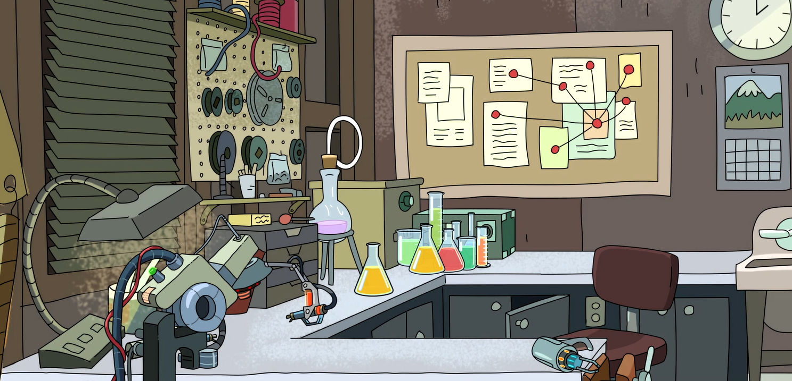

# The playhouse

The playhouse is an area for the free exchange of ideas: ideas for things that you would like to see done, things you have done, or for things that float your boat. Its intended purposes are for sharing of cool and/or useful content, and also to inspire interested souls to pursue further scientific investigation, be it on one's own time or in a formal capacity. There is the scope and freedom to engage in a non-traditional lab program, for example, building and testing a new experiment in place of using an existing system. This is but one option, so if you find you have a technical scratch which you want to itch, please [get in touch](mailto:physics.labs@utas.edu.au)!

!!! warning "Moderated content"

    Note that any user content that appears on this site is moderated, insomuch as you must submit it for it to be published; however, this is primarily to avoid spam and inappropriate content.

---

## Extensions of existing experiments

Some of the lowest hanging fruit for anyone with an interest is to extend the existing experiment and pursue a path of investigation that continues or compliments the original investigation

### Part II

#### KYA211: waves and kinetic theory

| Experiment | Further investigation(s) |
| :----- | :----- |
| Adiabatic index of gasses | An alternative measurement of $\gamma$ through a change in temperature during compression |
| Electron diffraction | Diffraction imaging, crystallography |
| Time-domain reflectometry | Dispersion analysis |

--8<-- "includes/abbreviations.md"
