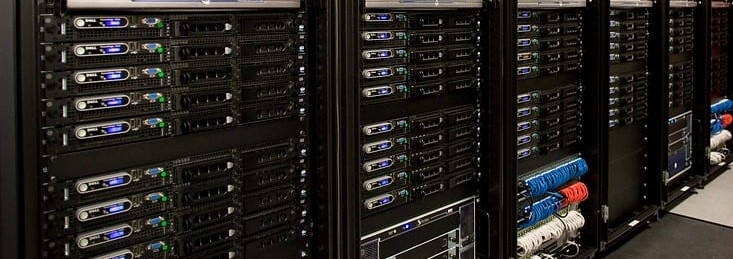

# Computation

To compute something is to have a model, and then run an instance of that model. This may be a simple arithmetic algorithm or something vastly more exotic, but in all cases, computations form the basis for predictions in science, and the best tools we have for performing computations are (the aptly named) computers. Here one will find information on the computational tools that one will encounter in the physics program here at UTAS.

{: .center}

---

## Introduction

Traditionally when studying physics, one will study electromagnetism and as part of this, one covers the important application of electrical circuits. The extension of analogue components to digital systems is often discussed in passing, and in an advanced physics study, the underlying quantum mechanics of discrete components is discussed (for example, how does a MOSFET function). Whilst this knowledge is useful, it is not necessary to operate a computer, and increasingly, it is critically important that one be aware of the power the can be accessed by computers for all manner of tasks,  but also be fluent in computational techniques. It is not the role of physics to teach computer science, but it is the role of physics to teach the usage of computer usage and computation in a scientific context.

## Computation in the curriculum

As part of the physics major, explicit blocks of computational content will be covered. As part of _KYA211: Waves and Kinetic Theory_, a four-week course on data handling is run to build proficiency in the collection, analysis, and presentation of experimental data. In _KYA321: Wave Mechanics and Quantum Mechanics_, computational physics laboratories are undertaken for six weeks with the aim of establishing competency in computational methods as applied to scientific problems. Beyond this, computational content may be baked into various courses, and experimental labs will make use of the computational literacy that has been developed in both the _data handling_ and _computation physics_ components of the degree.

## Tools of the trade

If you pose the question

> which is best?

to someone that is enthusiastic about computation, computers, or technology about any given aspect of their interest, you will likely be treated to a "detailed" response. This is because in most circumstances, there is no correct response, rather there are pros and cons, and one must make choices depending on the context. A pertinent example in the context of computational techniques in science is the choice of programming language: certain languages are blisteringly fast, but often come with significant overheads to achieve these speeds (notably knowledge and coding prowess), whereas other languages emphasise readability and accessibility, which comes at the cost of execution time or perhaps a fee. In science, common computational tools (languages or packages) one might encounter are:

* Programming languages
    * [Python](https://www.python.org/)
    * [R](https://www.r-project.org/)
    * [C](https://en.wikipedia.org/wiki/C_(programming_language))
    * [C#](https://en.wikipedia.org/wiki/C_Sharp_(programming_language))
    * [Fortan](https://fortran-lang.org/)
* Packages
    * [Mathematica](https://www.wolfram.com/mathematica/)
    * [Matlab](https://www.wolfram.com/mathematica/)
    * [LabVIEW](https://www.ni.com/en-au/shop/labview.html)

Each language has its time and place, and with proper training, moving between languages and packages isn't much of a burden: the underlying principles of scientific computation do not change, rather just the means for implementing the computation. Consequently, the choice of language is somewhat arbitrary; however, there are some considerations which elevate some languages above others for general situations:

- [x] Open source
- [x] Human readable
- [x] Well documented and supported
- [x] Broadly compatible
- [x] Broad applicability and extensive libraries

The language that best ticks these boxes is (arguably) `python`, and as such it is common to see it as the go-to language, and indeed, it is the language of choice here at UTAS. This doesn't mean that you cannot use other tools or languages, but the only supported language is `python`.

### Using `python`

Using python is simple enough, although it is a little more involved then an ordinary application. This is because unlike an ordinary application, as you write programs, you are often going to require the addition of new libraries or packages to aid with performing specific tasks, and thus a framework exists for collecting, organising, and compartmentalising these libraries. If one plays fast and loose with the management of these packages, that is where things can go awry, so it is worthwhile to spend a little time in the beginning to save yourself much more time down the road. UTAS also provides a platform for a streamlined `python` experience, which whilst less configurable, for the overwhelming majority of tasks it will be perfectly suited.

The specifics of learning to write and execute python code is something to be found elsewhere, but in many circumstances the use of `Jupyter`, a [web-based interactive development environment](https://jupyter.org/), is a great place to start[^1]. Detailed below are different ways of accessing `Jupyter ` for `python` use.

#### Local usage

Local usage of `python` as the name suggests means that an instance of `python` will run on the machine that you are using. This machine might be a university machine, for example a lab machine, or it might be your personal computer.

##### University machines

University machines (as configured for the physics labs) have `python` installed in the form of the [Anaconda distribution](https://www.anaconda.com/products/distribution). Anaconda is a popular flavour of python in the science community as most of the libraries that you are want to use are included in the base distribution. To start `Jupyter` for use with `python` using the Anaconda distribution, one can start `Anaconda Navigator` for a GUI oriented experience, or one can use the `Anaconda Prompt` for a command line experience. If using the navigator, one can select either `Notebook` or `JupyterLab` to start the IDEs, and if using the command line, one can execute either

`
jupyter notebook
`

or

`
jupyter lab
`

to start the web interface.

??? question "What is the difference between launching `Jupyter notebook` and `Jupyter Lab`?"

    A `Jupyter` notebook is where computations are conducted, whereas the hub is a more fleshed-out environment for executing `Jupyter` notebooks. So if you just want to quickly execute code, a notebook is probably what you want, whereas if you want to navigate directories and want the experience to be slightly more general than just running `python` commands, then lab is the better choice.

A major limitation of using the university machines is that should you wish to use a package which is not included in the Anaconda distribution, it is difficult (if not impossible) to make that happen. Fortunately, the distribution is expansive and it is unlikely that you would require something outside of the goodies already packaged.

##### Personal machines

Using python on a personal machine can be identical to [using python on a university machine](#university-machines), except the [Anaconda distribution](https://www.anaconda.com/products/distribution) must first be installed. You may also choose to pursue another path for `python` installation, and the [usage of a search engine](https://duckduckgo.com/?t=ffab&q=python+installation+guide&ia=web) can provide ample paths to follow; however it is recommended that you install Anaconda. It is worth noting that whilst the distribution contains many files, and consequently it may take quite some time to install, even incredibly modest machines (think low-power single-board computers) can execute python code quickly and without issue. For many applications, computational power is really not an issue, and any device will be capable of near-instantaneously calculating the quantities of interest.

#### Cloud usage

[Local usage](#local-usage), especially on one's own machine, has a special kind of power in the form of limitless configurability; however, sometimes one wants something that is easily accessible and just works. In these circumstances, it might be best to remotely execute `python` code, or in the case, remotely execute a `Jupyter` notebook. To that end, you are able to access `Jove`[^2], a `Jupyter` notebook server, which allows you to use notebooks remotely. Like other cloud services, this means that you can access and execute your code from anywhere; there are limits to the computational resources that are allocated to each notebook instance and how much storage can be used by a given user, but for most tasks these limits are very generous and it is unlikely that they will prove restrictive.

To access `Jove`, click the button below:

<figure markdown>
<a href = 'https://jove2021.cloud.edu.au/'> <i class="fab fa-python fa-5x"></i> </a>
    <figcaption>Access the jupyter notebook server Jove</a>
    </figcaption>
</figure>

In order to use the service, you are required to make an account, which can be done as shown in the animation below:

<figure markdown>
  
  <figcaption>The signup process for `Jove`</figcaption>
</figure>

From here, a notebook session should be spawned upon logging in. It is worth noting that if you are inactive for a period, the session will automatically close. It can immediately be reopened, but in order to ensure equitable distribution of computation resources, inactive sessions must be closed.

!!! danger "Cloud computing = someone else's problem"

    Cloud computing is a phrase that is bandied around with little care or thought, but it is not magic: if you are running code on "the cloud", the code is not being executed on your machine, but it is being executed on someone else's machine. In this case, it is a server allocated to physics from [TPAC](https://www.tpac.org.au/) (for which were are appreciative) and is maintained by the [facilities manager in physics](mailto:physics.facilities@utas.edu.au). If you have used any other cloud instance of `Jupyter`, you will appreciate the experience offered by `Jove`, and if you haven't, well, take it on faith that using them isn't always a positive experience. With that in mind, please treat to resource with respect lest it need be canned.

## Markdown

`[Markdown](https://en.wikipedia.org/wiki/Markdown)` is a _[markup language](https://en.wikipedia.org/wiki/Markup_language)_ which can be used to simply and beautifully format text^[3], with a major advantage being that even when it is not rendered, it is easily readable by humans, unlike say, HTML. Another advantage to many in the sciences is that when one is using ``[Jupyter](#using-python)`` notebooks to aim with programming in `python`, one can use `markdown` to embed formatted text in the notebook, making the code eminently readable. Indeed, it is for this reason that [experimental logbooks are required to be prepared using markdown](reference/experiment/#model-log-book).

Provided below are some tips and tricks for preparing `markdown` content, but there are countless excellent resources[^4] on the web for learning markdown, so you are encourage to look around.

### How do I markdown?

### Markdown cheat sheet

<figure markdown>
<a href = 'https://jove2021.cloud.edu.au/'> <i class="fab fa-markdown fa-5x"></i> </a>
    <figcaption>Github of rendered markdown</a>
    </figcaption>
</figure>

<figure markdown>
<a href = 'https://jove2021.cloud.edu.au/'> <i class="fab fa-github fa-5x"></i> </a>
    <figcaption>Github of markdown code</a>
    </figcaption>
</figure>

<figure markdown>
  [<i class="fab fa-python fa-5x"></i></i>](https://github.com/Andy-UTAS/POLUS/blob/master/docs/reference/experiment/model_log/examplelog.ipynb){ .md-button .md-button--primary class="text-center" style="margin-left: 0%"}
  <figcaption>Markdown on Jove</figcaption>
</figure>

### Images

can be imported via

```
![image][path/to/image.svg]
```

#### Captions

```
<figure>
    
    <figcaption> Caption </figcaption>
</figure>
```

### Equations

#### Alignment

```
$$
    \begin{align}
        V_{in} & =V_C+V_R \\
        & = \frac{q}{C} + IR
    \end{align}
$$
```

## Additional resources

There are no shortage of amazing computational resources to be found both on- and off-line, and these listed below are just a few resources which may prove useful:

* [Wolfram Alpha](https://www.wolframalpha.com/) is a the multitool for maths and statistics: whether you need to [find a series](https://www.wolframalpha.com/input?i=series+%28sin+x%29%2F%28x-pi%29+at+x%3Dpi+to+order+10) or want to know ["just how fast is warp speed?"](https://www.wolframalpha.com/input?i=warp+speed+6+in+deep+space+9), it will (after a bit of cajoling) likely be able to tell you what you want to know.
* [Jetbrains pycharm](https://www.jetbrains.com/pycharm/) is an incredibly powerful `python`-focused IDE, and whilst it has a free _community_ version, the expanded _professional_ version is [free for students and educators](https://www.jetbrains.com/community/education/#students)

[^1]: The [jupyter documentation](https://docs.jupyter.org/en/latest/) is excellent
[^2]: Jove is an [alternate name for the Roman god Jupyter](https://en.wikipedia.org/wiki/Jove_(disambiguation))

--8<-- "includes/abbreviations.md"
