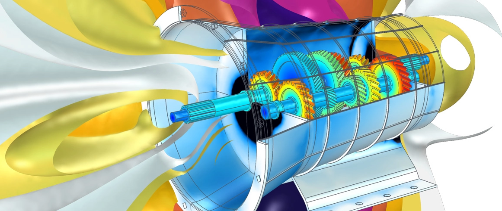

# Computing in physics

Despite needing to some particular tasks with an astonishing degree of regularity, it can often be the case that one forgets how exactly to do something. Whilst this is an excellent example of why one would want to have excellent [documentation](../experiment/#log-books), it is also a delightful utility to have a collection of high-utility snippets of code laid out in a navigable manner, which is precisely the goal of this page.

{: .center}

---

## Introduction

The content here is specifically for tasks to be performed in `python`, with details on getting started with this found [elsewhere](../computation). All code snippets as they appear here can be found in a more usable forms:

<figure markdown>
<a href = '#'> <i class="fab fa-python fa-3x"></i> </a>
    <figcaption>An executable notebook to run on <a href='../../reference/computation/#cloud-usage'>Jove</a>
    </figcaption>
</figure>

<figure markdown>
<a href = '#'> <i class="fas fa-code-branch fa-3x"></i> </a>
    <figcaption>A link to the notebook as hosted on Gitub
    </figcaption>
</figure>

!!! warning "Content under development"

    The content on this page is under active development, so caution should be taken accordingly. In the long term, it is envisaged that useful functions might be packed up and distributed as a library for physics; however, this is a long way off. At the moment, the page is little more than a list of things people requested help doing in the past.

- Peak finding
- Peak fitting
- Resampling with pandas (see pico usage note)
- Weighted least squares fitting
- Numerical integration

--8<-- "includes/abbreviations.md"
