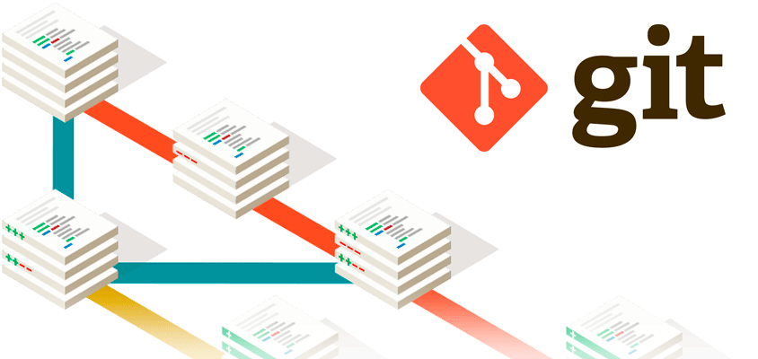
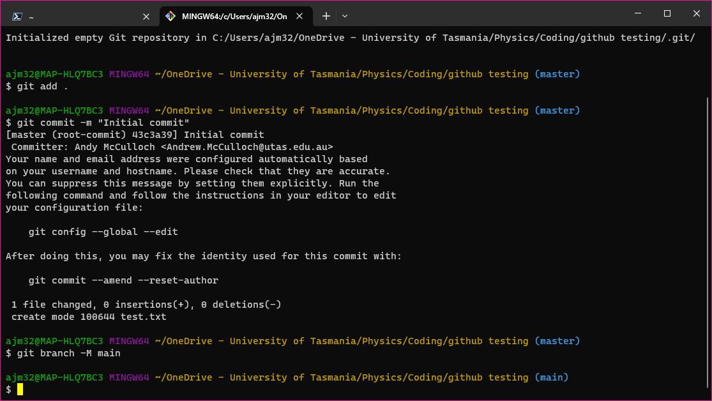
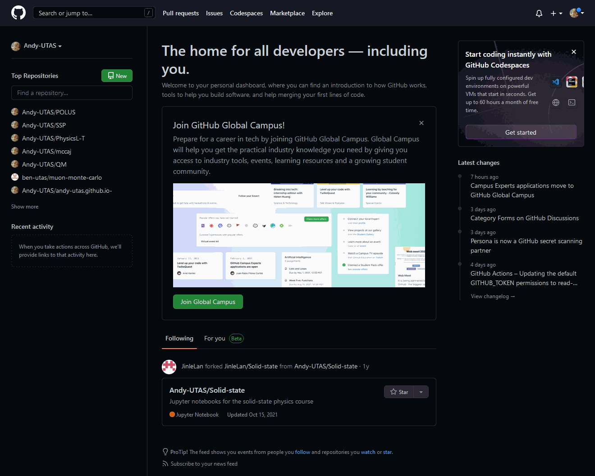
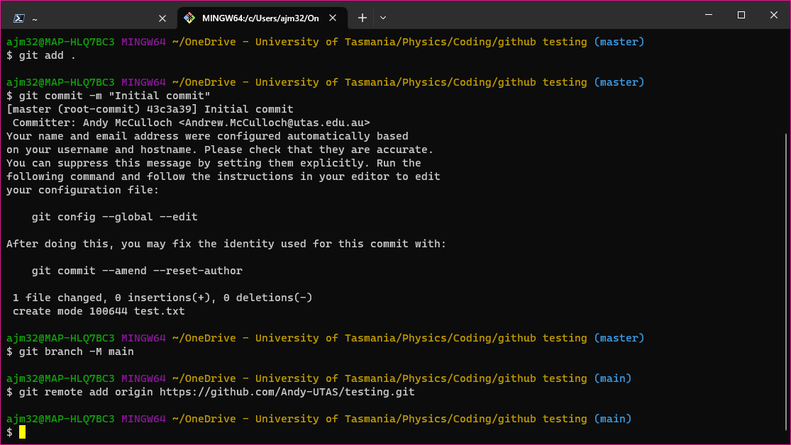

# Version control (git)

Have you ever been working on a project, and then realised that what was there previously was actually better? This may be due to making a mistake in your recent work, or you may have just been in the zone last time and only appreciated this after you had scrapped the work you did previously only to replace it with absolute junk and hit save. Or perhaps you are trying to work collaboratively with someone else, or many other people on complex projects which have many constituent parts - as is common in software development - and you are having difficulty knowing which files have been changed, and which parts of the file have been changed. Enter: version control.

{: .center}

---

## Introduction

The undertaking of complex projects has always demanded that one fastidiously keep track of progress, and the growth of collaborative projects which are increasingly undertaken non-locally, that is, they are not undertaken at the same place or on the same device, has seen the development of excellent ways of not only tracking progress, but also distributing the progress of one member of a team to all other members of the team. The most common way to accomplish this is by using _distributed version control_, which essentially boils down to all files which within a project - including the history of all files - being mirrored on any device which is used to contribute to the project. Beyond this, there are clever means and standard protocols to ensure problems such as conflicting changes to files arising from simultaneous editing are handled and don't break the whole system. These methods of working are standard across all industries and once you start using them, you will see why.

## Git

Perhaps unsurprisingly, there are quite a few options for distributed version control, but the largest by far is the free and open source software [git](https://git-scm.com/).

!!! Warning "git versus GitHub"
    You may have heard of one or both of [git](https://git-scm.com/) or [GitHub](https://github.com/), and it is important to know that these are distinct entities! We shall flesh out their relationship below, but do not make the mistake of thinking they are the same thing!

    `git`

    :   is a revision control system, a tool to manage your source code history

    `Github`

    :   is a hosting service for git repositories

    In a crude sense, git is the _tool_ whilst GitHub is the _service_ for projects that use git.

We begin by looking at using git, and then will move on to how to use GitHub. This resource is really a _how to get started_ page, not a full _how to use_ guide, but following one of those - for example, the [git documentation](https://git-scm.com/book/en/v2/Getting-Started-About-Version-Control) or [GitHub training manual](https://githubtraining.github.io/training-manual/#/01_getting_ready_for_class) - will teach you all that you could ever want to know.

### Getting started

Suppose that you have a directory containing content for a project: this could be a simple text document, a complex website (like this one!), or a lab lobgook and associated data, and we want to have some version control over the project. To do this, we are going to use git, and specifically the git command line. If you are using a lab machine, git will be installed; however, if you are using your own machine, git can be downloaded from [here](https://git-scm.com/downloads). When you first run download and run git, it is important to set some global parameters, as these will be used for all git actions. It is worth noting that this only needs to be done once on your initial setup, or again whenever you use a new machine. Begin by setting your name and email via:

``` git title="Set your identity"
git config --global user.name "John Doe"
git config --global user.email johndoe@example.com
```

and you can check this worked by executing the command

``` git title="Verify your identity"
git config user.name
```

which in this case should return `John Doe`. With our git setup, we can now look to creating a _repository_. You will need to begin by navigating to the directory containing your project, e.g.

``` git title="Navigating to the project directory"
cd C:/path/to/directoy
```

{: .center}

and then the repository can be initialised using

``` git title="Initialise a directory"
git init
```

{: .center}

which will create a new directory `.git` to store all the version control information. With the presumption that there is content in the directory, we can go ahead and add all files in the directory via

``` git title="Add all contents of the directory"
git add .
```

{: .center}

which now means that any changes to these files will be included in our version control. Importantly, we must now _commit_ these changes (that is, adding the files) which can be done using the `commit` command

``` git title="Perform initial commit"
git commit -m "Initial commit"
```

{: .center}

Finally, we are going to change the _branch_ to `main`, which as the name suggests is the main branch of our repository:

``` git title="Change the branch"
git branch -M main
```

{: .center}

Whilst this all may seem like voodoo if you are unfamiliar with version control, it will hopefully become clear through the usage. As a blunt instrument, the above commands of

``` git
git add .
git commit -m "Comment to describe changes"
```

 can be used to update the entire directory, which after following the initial setup is often the desired outcome.

To try and elucidate the status of files during the editing process, shown below is an illustration of the lifecycle of the status of files in the repository:

{: .center}

and should you wish to ever verify the status of files in the repository, you can execute

``` git
git status
```

## GitHub

In the section above, we have created a local git repository for our work (:partying_face:) but often, this is insufficient as we may want others to access the content. This is where services like [GitHub](https://github.com/) come in, as they allow us to store our git repositories online. In order to use GitHub, you will need to [create an account](https://github.com/join). From here, there are a few ways to proceed, but we are going to continue with what is conceptually the simplest:
1. We are going to make a repository on GitHub
2. We are going to _push_ our existing local repository to GitHub

### Creating a remote repository

Creating repositories is a simple process, with the most difficult bit being providing a useful name and useful file structure. For example, in the context of labs, do you want a repository for each experiment, or one repository for all experiments? These are decisions that you will have to make - and live with - but once you have the idea of what you want to do, you can select `New` and then follow the instructions or the animation below:

<figure markdown>
  
  <figcaption>Creating a repository on GitHub</figcaption>
</figure>

You now have an (empty) online repository.

### Adding a remote repository

The final step to hosting your content on GitHub is to _push_ your local content. To do this, you must first tell git where to push the content:

``` git title="Add an existing remote repository"
git remote add origin <URL>
```

{: .center}

and then execute the push

``` git title="Push content to remote repository"
git push -u origin master
```

{: .center}

And that's it! :champagne: Your content will now be accessible on GitHub, ready for collaboration or distribution.


--8<-- "includes/abbreviations.md"
