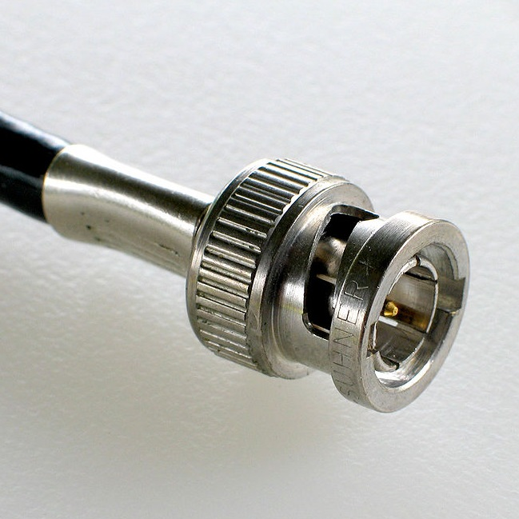
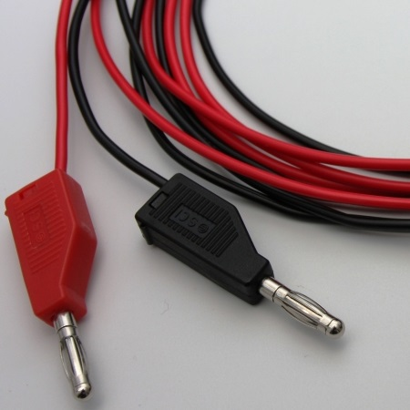
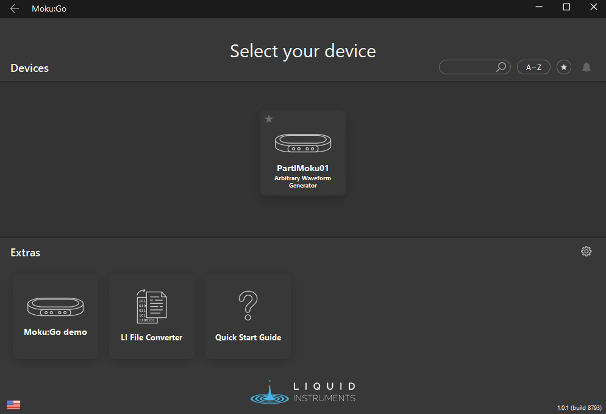
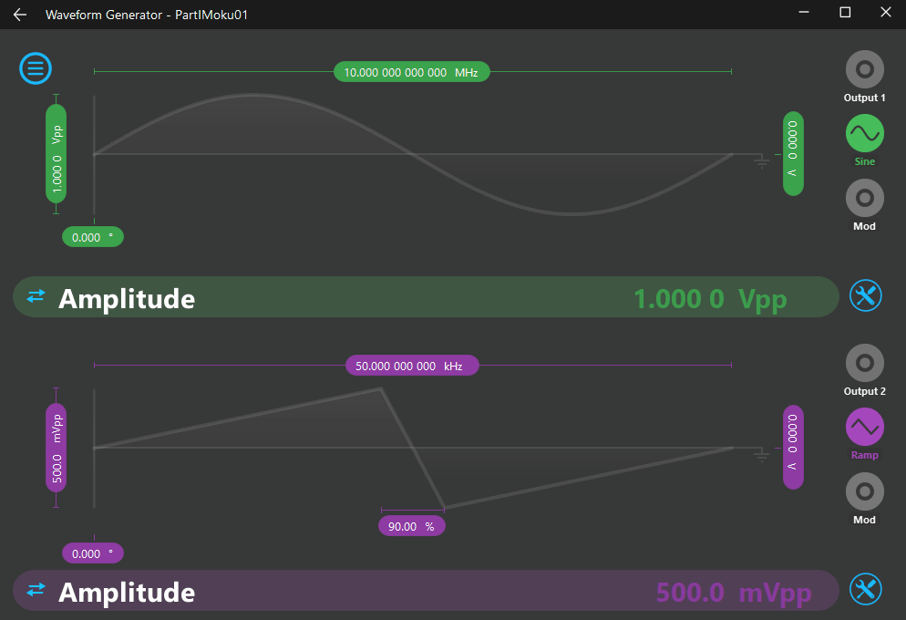
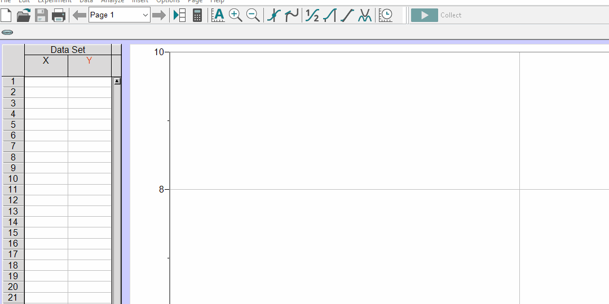

# Hardware

This page is designed to be a veritable cornucopia, in that is provides an abundance of information and resources on most of the hardware devices that one might encounter in the physics labs here at UTAS.  

---

## Guides and manuals

An often overlooked skill in science and other disciplines which concentrate on problem solving is the ability to both source and digest instructional materials. Proficient use of [an internet search engine](https://duckduckgo.com/) can go a long way to solving most problems; however, establishing a repository of commonly required documents can go some way to streamlining the process, especially in the case of antiquated or bespoke equipment.

Where possible, device manuals as prepared by the manufactures have been sourced; whilst usually very thorough, they are often terse. As a remedy to this, usage notes have been prepared to provide a succinct discussion of devices in the context of their deployment and usage at UTAS. Support materials, usually in the form of python code and sample data are also provided where relevant.

### List of analogue devices and uses

=== "Part I"

    | Device | Purpose |
    | :-----: | :----- |
    | Callipers | Precise measurement |

=== "Part II"

    | Device | Purpose |
    | :-----: | :----- |
    | Callipers | Precise measurement |
    | Barometer | Atmospheric pressure measurement |
    | Regulator | Pressure regulation of high-pressure gases |

=== "Part III"

    | Device | Purpose |
    | :-----: | :----- |
    | Callipers | Precise measurement |

### Analogue devices

#### Barometer

<figure markdown>
<a href = 'Barometer notes.pdf'> <i class="fas fa-book fa-3x"></i> </a>
    <figcaption>Barometer usage note
    </figcaption>
</figure>

---

### List of digital devices and uses

Different devices with different levels of sophistication are used across the different years and consequently they are best indexed by the level of study

=== "Part I"

    | Device | Model | Description |
    | :-----: | :-----: | :----- |
    | Software-defined instrument | [Moku:Go](#mokugo) | Multipurpose device |
    | Hardware interface | [Vernier Labpro](#vernier-labpro) | Collect data from sensors |

=== "Part II"

    | Device | Model | Description |
    | :-----: | :-----: | :----- |
    | Digital (storage) oscilloscope | [Rigol DS2102E](#rigol-ds2102e-oscilloscope) | Electronic test instrument,  advanced measurement device |
    | Arbitrary waveform generator | [Rigol DG1032Z](#rigol-dg1032z-signal-generator) | Signal generator |
    | Data logger | [Pico Technology ADC20 and 2000](#pico-technology-adc20-and-2000) | Measurement device |

=== "Part III"

    | Device | Model | Description |
    | :-----: | :-----: | :----- |
    | Digital (storage) oscilloscope | [Rigol DS2102E](#rigol-ds2102e-oscilloscope) | Electronic test instrument,  advanced measurement device |
    | Arbitrary waveform generator | [Rigol DG1032Z](#rigol-dg1032z-signal-generator) | Signal generator |
    | Data logger | [Pico Technology ADC20 and 2000](#pico-technology-adc20-and-2000) | Measurement device |
    | Single-channel analyser | [Spectrum Techniques UCS30](#spectrum-techniques-ucs-30) | Measurement device |
    | Software-defined instrument | [Moku:Lab](#mokulab) | Multipurpose device |

### Devices

#### Moku:Go

The `Moku:Go` is a multipurpose, software-defined instrument with the main use of the device being a testing instrument and as a power supply. To physics connections must be made to the device directly using either cables with BNC connectors (for signal input and output) or cables with banana plugs (for powering circuits or devices).

??? info "Connector types"

    <figure markdown>
      { width=450 }
      <figcaption>A BNC connector for coaxial cable</figcaption>
    </figure>

    <figure markdown>
      { width=450 }
      <figcaption>Banana-style connectors for monofilament or multistrand cable</figcaption>
    </figure>

To use the `Moku:Go`, one must use the _Moku:Go desktop app_, which should be installed on all laboratory machines, and further information of the software can be found [elsewhere](../software/#mokugo). In order to use the device, one should open the _Moku:Go desktop app_ software, and with the device powered on and connected (either by USB or Ethernet) select the device from the list of available devices. Once connected, one can select the desired instrument from the menu and proceed to use the device. The connection process is shown below:

<figure markdown>
  
  <figcaption>Connecting to the `Moku:Go` in the _Moku:Go desktop app_</figcaption>
</figure>

The available software defined instruments are listed below, along with specific details and instructions.

| Device | Usage |
| :-----: | :----- |
| Oscilloscope | An oscilloscope to measure time-varying signals |
| Spectrum Analyzer | A spectrum analyser to determine the frequencies present in a signal |
| Waveform Generator | A waveform generator best suited to producing simple periodic signals |
| PID controller | A control system used to stabilise an external system using measurement and feedback |
| Data Logger | A data logger to measure and record input signals over a defined period |
| Frequency Response Analyzer | A tool used to measure the frequency response of a system |
| Arbitrary Waveform | A waveform generator suited to creating complex (arbitrary) signals |
| Logic Analyzer | A tool for the analysis of digital communication protocols |
| [Power supply](#power-supply) | Used to power systems |

##### Power supply

Power supplies are used to power devices, and provide current or voltage to a circuit. Each `Moku:Go` has 4 power supply outputs, with the channels 1-4 running from left to right on the back of the device. Different channels are capable of different output currents/voltages, and the specifications are listed in the table below.

| Channel | Voltage | Current |
| :-----: | :-----: | :-----: |
| 1 | -5 to +5 V | 0 - 150 mA |
| 2 | 0 to +16 V | 0 - 150 mA |
| 3, 4 | 0.6 to +5 V | 0.06 - 1 A |

**In order to use the power supply, one must have an instrument activated**. So even if you only want to use the power supply, you must initiate an instrument (it doesn't matter which) and then the power supply parameters can be selected and configured from the menu on the left hand side by selecting `Power supply`. Set the desired value(s) for current and voltage for the different channels, and ensure to enable the output by clicking the switch on the top right of each channel, as shown below.

<figure markdown>
  
  <figcaption>Accessing and activating a power supply whilst using a `Moku:Go` application</figcaption>
</figure>

##### Additional resources
[:material-web: Manufacturer's website](https://www.liquidinstruments.com/products/hardware-platforms/mokugo/)

#### Moku:Lab

##### Additional resources
[:material-web: manufacturer's website](https://www.liquidinstruments.com/products/hardware-platforms/mokulab/)

#### Pico Technology ADC20 and 2000

<figure markdown>
<a href = 'PicoLogger notes.pdf'> <i class="fas fa-book fa-3x"></i> </a>
    <figcaption>PicoScope usage note
    </figcaption>
</figure>

#### Rigol DS2102E (oscilloscope)

<figure markdown>
<a href = 'DS2102E notes.pdf'> <i class="fas fa-book fa-3x"></i> </a>
    <figcaption>DS2102E usage note
    </figcaption>
</figure>

<figure markdown>
<a href = 'ds2000e-userguide.pdf'> <i class="fas fa-book fa-3x"></i> </a>
    <figcaption>DS2102E user guide (instruction manual)
    </figcaption>
</figure>

{width="800" : .center}

{width="800" : .center}

#### Rigol DG1032Z (signal generator)

<figure markdown>
<a href = 'DG1000Z User's Guide.pdf'> <i class="fas fa-book fa-3x"></i> </a>
    <figcaption>DG1000Z user guide (instruction manual)
    </figcaption>
</figure>

#### Spectrum techniques UCS-30

<figure markdown>
<a href = 'UCS30 notes.pdf'> <i class="fas fa-book fa-3x"></i> </a>
    <figcaption>UCS30 usage note
    </figcaption>
</figure>

<figure markdown>
<a href = 'UCS30-Manual.pdf'> <i class="fas fa-book fa-3x"></i> </a>
    <figcaption>UCS30 user guide (instruction manual)
    </figcaption>
</figure>

#### Vernier LabPro

[:material-web: manufacturer's website](https://www.vernier.com/product/labpro/)

The `LabPro` is an interface which is used to power a range of sensors, in addition to interpret and process the signals produced by the detectors allowing for the collection of experimental data via computer.

To use the LabPro interface, the program _Logger Pro_ must be used, which should be installed on all UTAS lab computers, and details on the software can be found [elsewhere on this site](../software/#logger-pro). The sensors to be used in conjunction with the interface are listed below

##### Radiation monitor

[:material-web: Manufacturer's website](https://www.vernier.com/product/vernier-radiation-monitor/) // [:material-file-pdf-box: Manual](hardware/VernierRadiationMonitor.pdf) // [:fontawesome-regular-file-pdf: Usage Note](#)

The radiation monitor (Vernier VRM-BTD) detects $\alpha$, $\beta$, $\gamma$, and X-ray radiation. The detector does not provide any information beyond an indication that radiation has been detected, returning a "count" each time the detector is triggered. To retrieve these counts, one must connect the radiation detector to a `DIG/SONIC` port on the `LabPro`, and then tell the _Logger Pro_ software to collect data from the radiation sensor. The process to do this is illustrated in the animation below:

<figure markdown>
  
  <figcaption>Setting up the radiation detector in Logger Pro</figcaption>
</figure>

## Advanced/extension content

Lab work is a great way to see complex and highly-capable software and hardware systems, but for most, it really marks the beginning of the journey. Content here is best consumed by discerning individuals or groups, as it is aimed at those with an eye to moving beyond basic functionality: learning not just how to drive the thing, but aspiring to compete in the [Dakar Rally](https://en.wikipedia.org/wiki/Dakar_Rally).

At this stage, content is still in development, but resources exist in the alpha stage for interfacing with both the Rigol DS2102E DSO and Rigol DG1032Z AWG. If you are interested in discussing or developing resources for either existing or new pieces of hardware, do not hesitate to get in touch!

--8<-- "includes/abbreviations.md"
