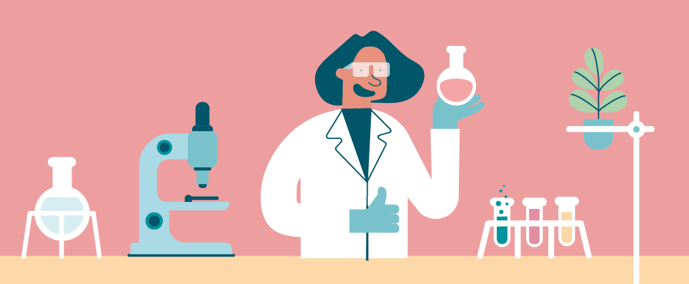

# Safety in the lab

Safety is the mitigation and avoidance of bad outcomes, be it the control of identified hazards, the active protection from harms, or the application of appropriate and effective care in an emergency. Experimentation necessarily exposes one to activities outside those of the quotidian, and it is critical that these circumstances are navigated with diligence and competency

---

## Why should I care?

It is often an instinct to think of safety as it relates to oneself, but it is important to highlight that the circle of concern includes the safety of others, and of the environment. It should also be emphasised that no safety framework is infallible: effort is made to eliminate risk, but a system can only be deemed safe when operating under certain conditions with particular parameters. If the security and well-being of you, your peers, and the environment cannot motivate you to engage in safe practices, the recommended action is to undertake a thorough program of introspection.

## Safety at UTAS

There are myriad materials pertaining to safety at the university, distributed at each level of administration: at university, college, school and discipline level. The aim of this page is to succinctly summarise the pertinent information and serve as a *one-stop shop* for safety information.

### Campus safety

The university provides extensive safety resources on the [Safety and Wellbeing webpage](https://www.utas.edu.au/safety-and-wellbeing/home), including an index of relevant [information and documents](https://www.utas.edu.au/safety-and-wellbeing/information-and-documents). This repository is mostly complete; however, the information is not presented in a digestible format. To that end, short courses which cover the basic safety principles have been developed, and **it is a requirement that all students and staff complete basic training modules in both general and COVID-19 safety**, which are linked below:

<figure markdown>
[<i class="fas fa-university fa-5x"></i>](https://mylo.utas.edu.au/d2l/home/501512){ .md-button .md-button--primary class="text-center" style="margin-left: 0%"}
<figcaption>Safety and Wellbeing Induction</figcaption>
</figure>

<!-- <figure markdown>
[<i class="fas fa-book-medical fa-5x"></i>](https://mylo.utas.edu.au/d2l/home/426741){ .md-button .md-button--primary class="text-center"}
<figcaption>A COVID-Safe Campus</figcaption>
</figure> -->

### Lab safety

In much the same way that is is difficult to cover all aspects of safety that pertain to life at a university, it is difficult to cover all aspects of safety that pertain to experimental labs. In an effort to streamline the burden on both staff and students, a laboratory and workshop module has been developed with the explicit goal of providing a brief introduction to a range of safety considerations in a broad range of contexts, acting as a starting point for lab safety. Different work environments pose different hazards, and are graded accordingly using a <i>traffic light</i> system to indicate the level of training required before work can be undertaken; however, <b>it is a requirement that all students and staff complete the <i>green-level</i> training module</b> linked below:

<figure markdown>
[<i class="fas fa-flask fa-5x"></i>](https://mylo.utas.edu.au/d2l/home/499939){ .md-button .md-button--primary class="text-center"}
<figcaption>Laboratory and Workshop Inductions</figcaption>
</figure>

--8<-- "includes/abbreviations.md"
