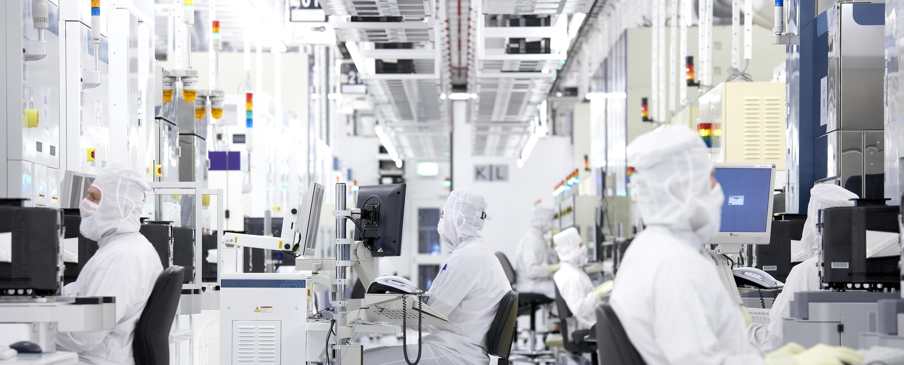
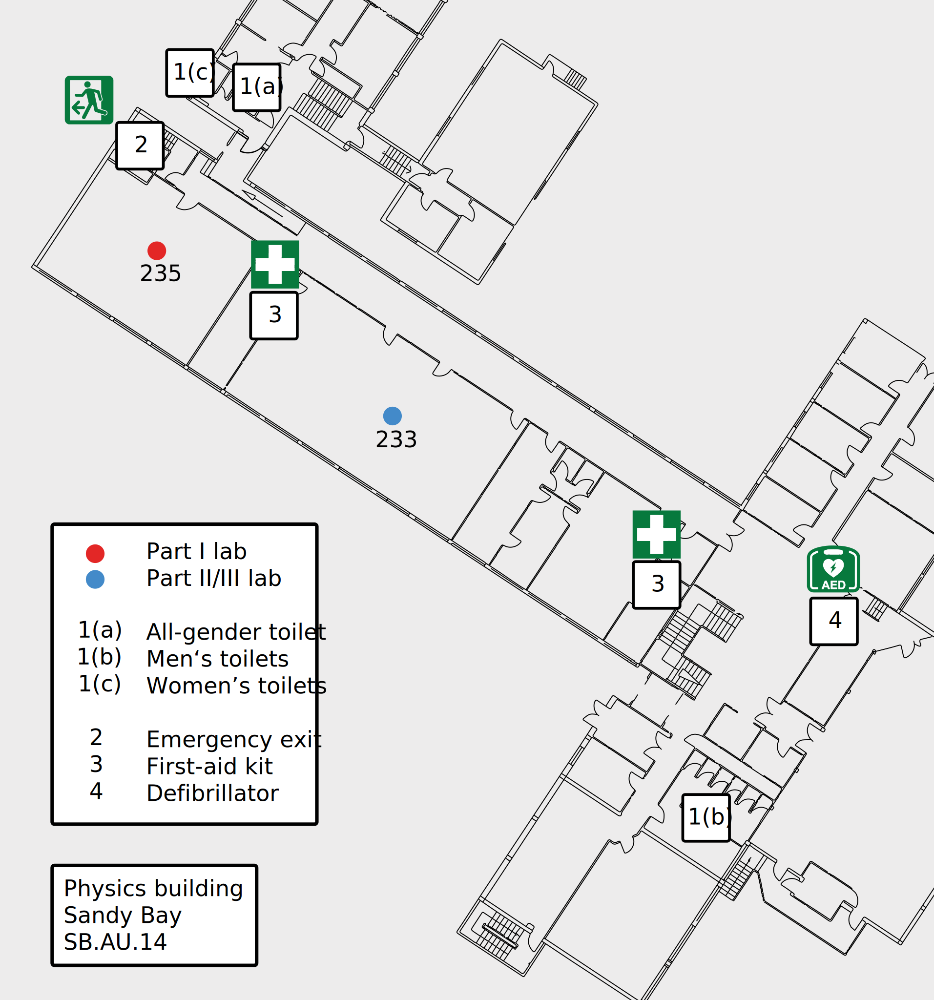

# Lab inductions

## What needs to be done before I can do lab work?

- [ ] University-wide [Safety and Wellbeing Induction](https://utasphys.cloud.edu.au/safetyandwellbeing)
- [ ] University-wide [laboratory and workshop induction module](https://utasphys.cloud.edu.au/labinduction)
    * [ ] Upload the completion certificate to the relevant dropbox on MyLO
- [ ] Subject specific lab and building induction, which will be run at the beginning of the first session

If applicable, experiment-specific concerns will be discussed prior to undertaking a given experiment.

## Laboratory and building induction

<!-- ### General rules

* Never work alone in the laboratory.
* Always wear adequate foot covering; bare feet, thongs, open-toed or backless shoes are not permitted. High-heeled shoes are discouraged.
* No food or drink are permitted to be consumed in the laboratory.
* Never run in the lab.
* Long hair or very loose clothing or jewellery may be a hazard around experiments with fast-moving or heavy parts, or machinery. There are not many such situations in our laboratories, but demonstrators may require you to remove dangerous items or tie back your hair before approaching potentially hazardous equipment.
* Immediately clean any spill of water or other liquids. Few of the experiment involve liquids, and no drinks are allowed in the lab, but as a reminder: water and electricity don’t mix. Water must never be placed where it could potentially spill onto electrical equipment. -->

### Summary

Laboratory work is a cornerstone of an education in the natural sciences. Unlike theoretical and computational work, experiments may involve hazards which can pose the threat of harm to you or those around you. The university is subject to both federal and state legislation which is designed to provide safe working environments, and the university strives to provide the safest operating conditions possible; systems are designed to eliminate hazards, but these are not infallible. Moreover, a tenet of science education is how to conduct science in a way that benefits everyone, which involves identifying, minimising, and navigating risks. Consequently, the university places an emphasis on active engagement in both understanding and executing best-practice safety procedures.

### Safety

If you have a question regarding safety (or anything else), do not hesitate to consult with your demonstrator(s) or contact the [physics lab team](mailto:physics.labs@utas.edu.au).

#### General safety
The [UTAS safety and wellbeing](https://www.utas.edu.au/safety-and-wellbeing) page is the best resource of all things related to health and safety at the university. Note that it is a requirement that all members of the university community complete the [Safety and Wellbeing Induction](https://utasphys.cloud.edu.au/safetyandwellbeing) module at the beginning of each year.

#### Laboratory safety

_The risks posed by undergraduate laboratory experiments have been examined in line with the university's risk management framework, and the risk assessment is available on request._

It is a university requirement that all laboratory participants complete the "Green level induction" of the [Laboratory and Workshop Inductions](https://utasphys.cloud.edu.au/labinduction) module on MyLO, which provides a broad overview to safety in laboratory and workshop environments. More locally, in order to participate in the laboratory program, one must:

* Follow all instructions given by the laboratory demonstrator(s)
* Work under the supervision of a demonstrator
* Wear closed-toed shoes at all times
* Tie up long hair when in the laboratory
* Not eat or drink in the laboratory

One should also be familiar with the local facilities. Laboratory work primarily takes place in rooms 233 and 235 of the [physics building](https://www.openstreetmap.org/way/23959304) (SB.AU.14) and the following are important features, as illustrated in the map below:

1. Toilets are located close to the laboratory:
    1. All-gender toilets can be found in corridor 239(northern corner, turn left into the corridor when leaving the laboratory)
    2. Men's toilets can be found in room 217 (south-west corner, turn right into the corridor when leaving the laboratory)
    3. Women's toilets can be found in corridor 239 (northern corner, turn left into the corridor when leaving the laboratory)
2. The emergency exit is located on the north-western end of the corridor which is used to access the laboratory. In the event of an evacuation, the designated meeting point is the \href{https://www.openstreetmap.org/relation/6437466}{central thoroughfare} between the physics and chemistry buildings; however, you demonstrator will direct you in the case of an emergency.
3. A first-aid kit is located in room 235, which is accessed through the door at the front of the laboratory
4. A defibrillator can be found in the "lobby" area of the building (room 201)

#### Lab-specific safety
Individual experiments can pose specific risks, and these are identified in the notes provided for the individual labs.

#### COVID-19 safety

The disease caused by the severe acute respiratory syndrome coronavirus 2 (SARS-CoV-2) virus has dramatically altered the way in which university education is delivered. The university has a [COVID-Safety plan](https://www.utas.edu.au/safety-and-wellbeing/information-and-documents/risk-topics/covid-safe) in place in an attempt to ensure the health and safety of students and staff. In order to be allowed on campus:

* Each day when on campus, one must pass through a "[health screening](https://www.utas.edu.au/__data/assets/image/0020/1340345/Health-Screening-Stations-SM.jpg)" station
* One must comply with government health advice, ensuring observation of physical distancing and good hygiene protocols
As the university's safety plan pertains to conducting laboratory work:
* Hand sanitiser must be used on entry and exit to the laboratory
* Your bench, along with all equipment, should be cleaned using the supplied disinfectant wipes prior to use.
* Social distancing should be implemented as much as is practicable

### Part I
The part I lab induction will be delivered in the first class of the year with a refresher provided in semester two for anyone that missed that did not attend the semester one session.

### Part II
The part II lab induction will be undertaken during the first lab session of the year, with a refresher provided in semester two for anyone that missed that did not attend the semester one session.

### Part III
The part III lab induction will take place during the first "common session" of the year, the week following computation physics laboratories.

---

## Checklist

- [x] University-wide [Safety and Wellbeing Induction](https://utasphys.cloud.edu.au/safetyandwellbeing)
- [x] University-wide [laboratory and workshop induction module](https://utasphys.cloud.edu.au/labinduction)
    * [x] Upload the completion certificate to the relevant dropbox on MyLO
- [x] Subject specific lab and building induction, which will be run at the beginning of the first session

--8<-- "includes/abbreviations.md"
