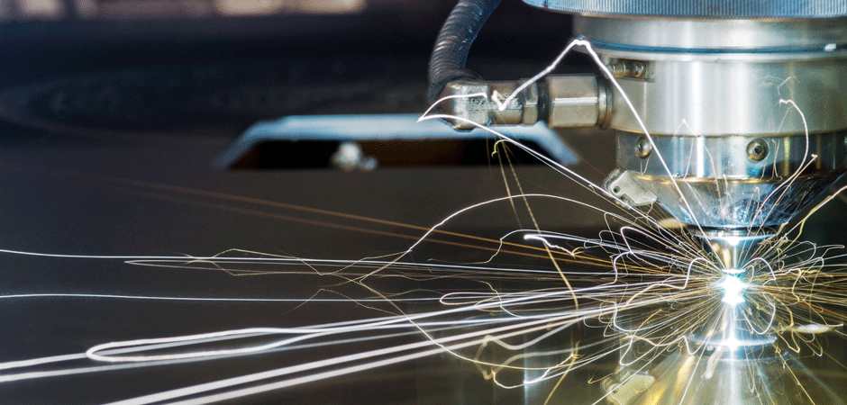
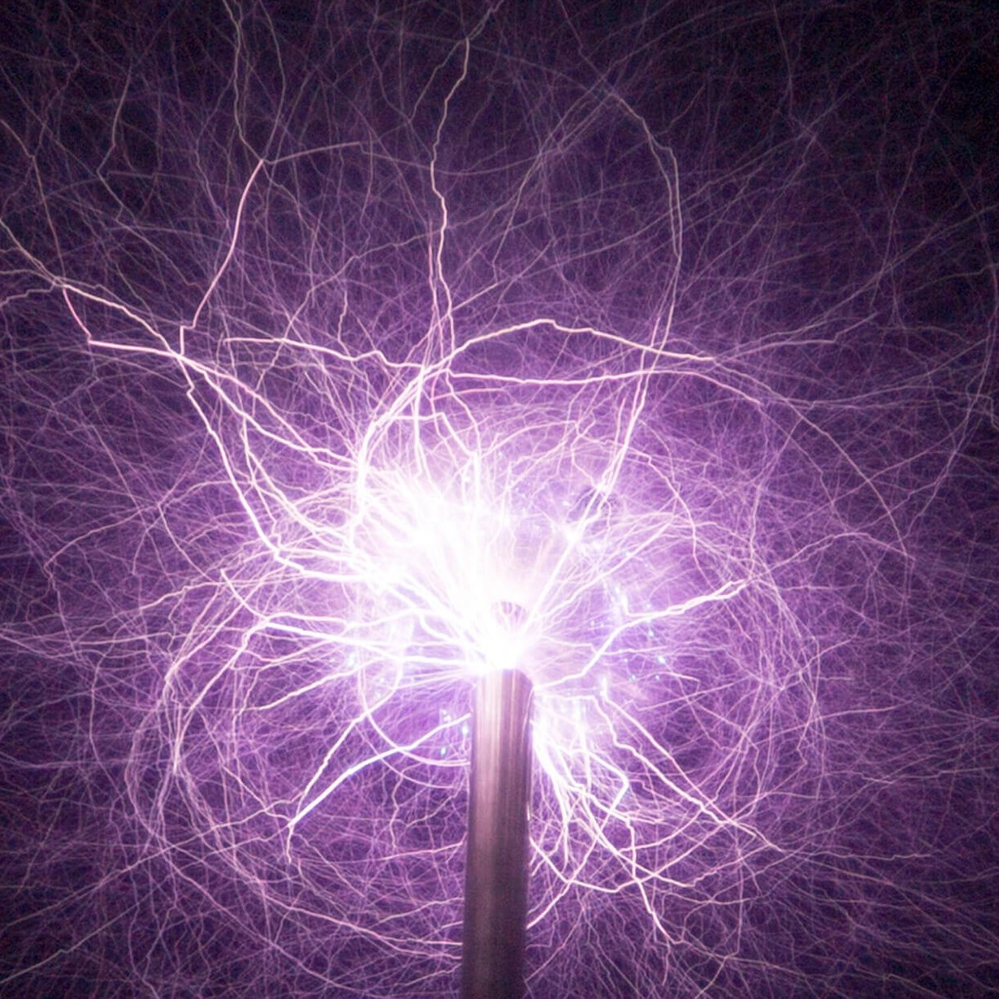
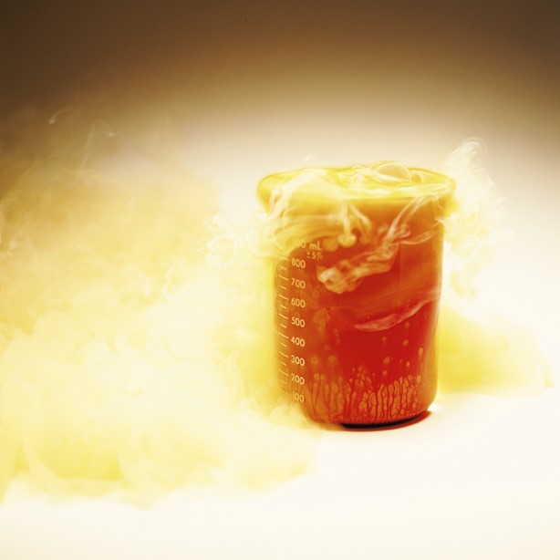
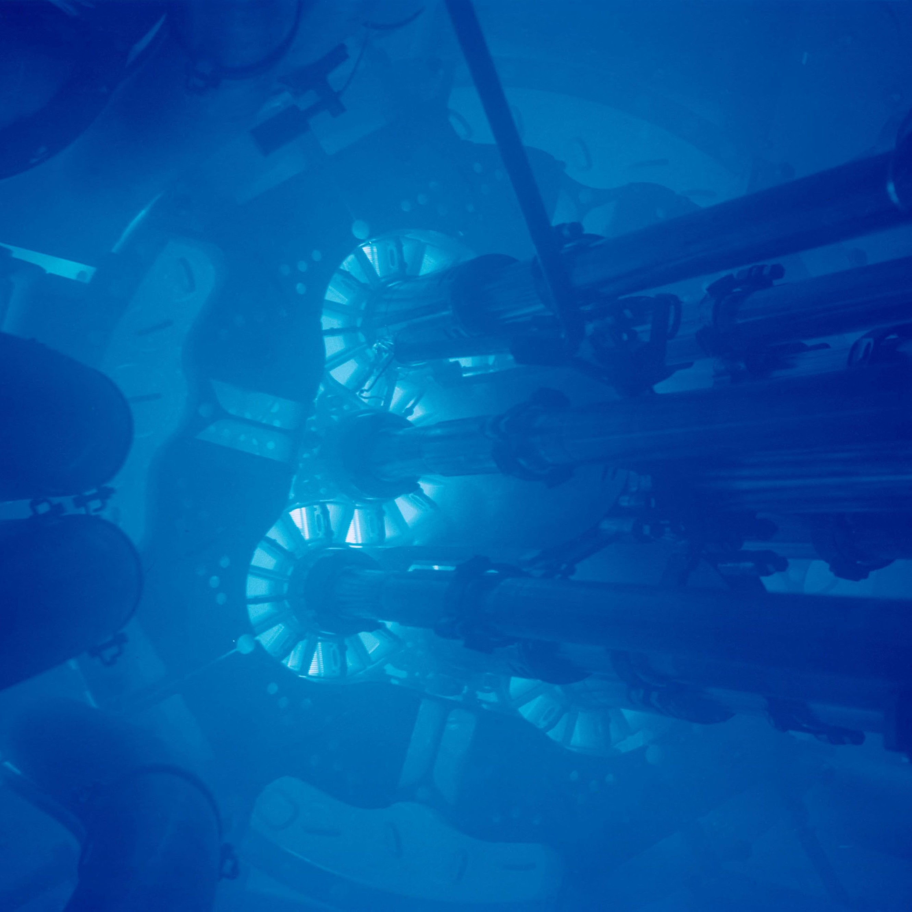
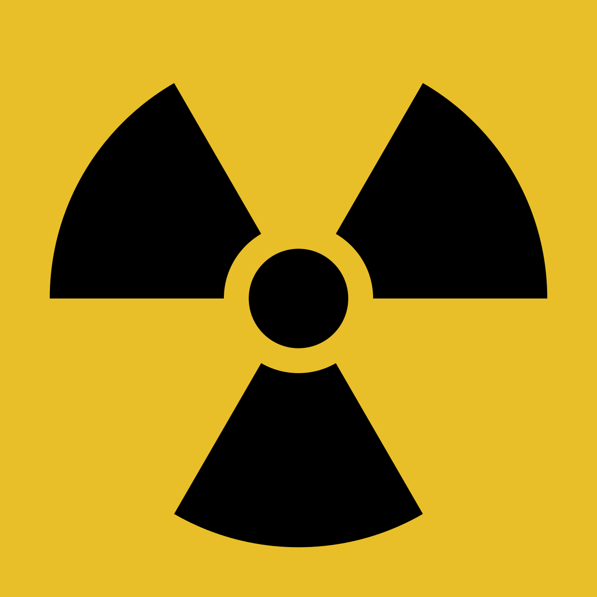
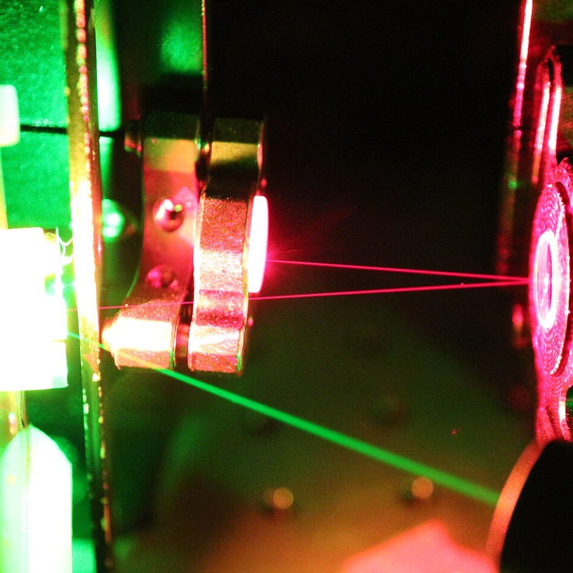
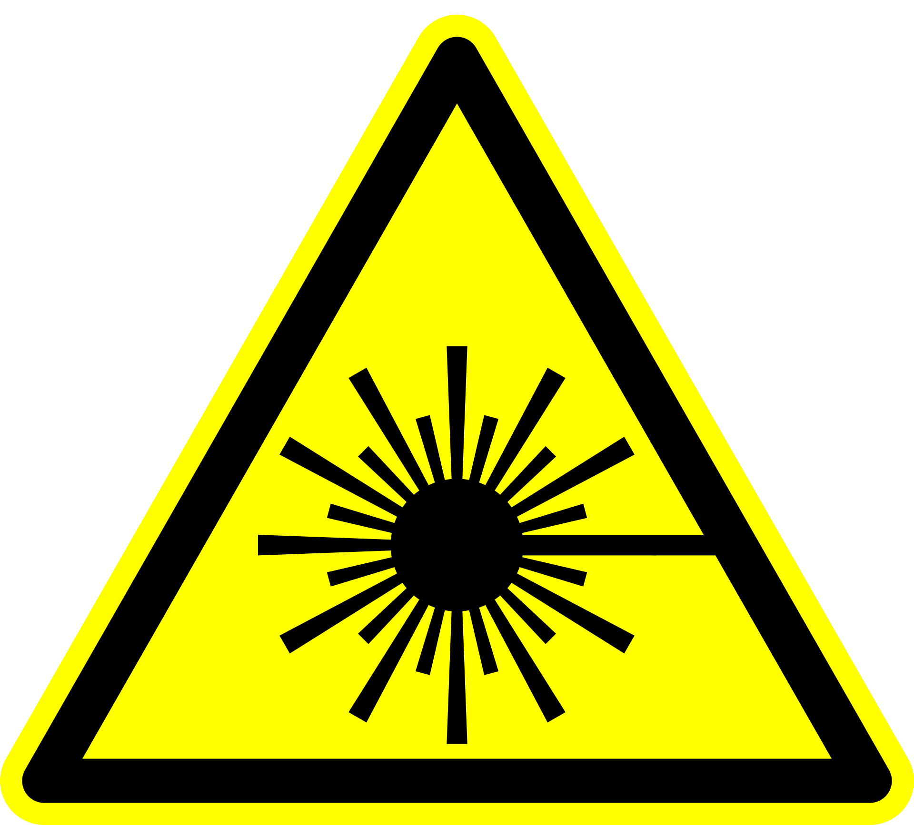

# Safety in physics laboratories

One can attempt to disseminate best-practice safety procedures with broad brush strokes, but in many situations, including experimental work in the physical sciences, the risk and procedures are highly specialised and unique to the area or activity. Consequently, in addition to the [safety content that is centrally managed by the university](../) there are physics-specific safety concerns which are addressed here.

---

## Responsibility

Safety is not the responsibility of a single person or group, but rather it is a responsibility which belongs to everyone. It is the responsibility of each person to be aware of the risks posed by a given activity, be cognisant of the methods for the mitigation of said risks, and know what should be done in the event of an accident. Moreover, we seek to create a positive culture of safety: this does not mean avoiding activities that pose danger, on the contrary, it is about ensuring we can perform the tasks and activities which enrich the study of the natural world whilst minimising the chance of a bad outcome.

!!! info "Duty of care"
    A duty of care is the responsibility that all of us have to ensure that we, and those around us are safe. Legally, the university has a duty of care to staff and students, but individually and as a society, we have a duty of care to one another: things would be a bit grim if we didn't look out for one another! To co-opt a well-known "law"[^1]:
    > [You] may not injure [another person] or, through inaction, allow a [person] to come to harm

    which captures the sentiment well: yours demonstrators have a duty of care towards you, as do your peers, and you have a duty of care to yourself, your fellow students, and your instructors.

### Understanding risks

<a href="https://xkcd.com/2038/">{width="250" align=left}</a> Risks come in a [variety of shapes and forms](#risks) and thus it is important to be aware of the hazards that exist. It is also important to have a sense of proportionality and pragmatism when it comes to navigating risk: some things are extremely dangerous, but pose little danger when properly managed (e.g. mains electricity), whereas things we judge to pose little threat can be responsible for serious harm (e.g. falling over)[^2]. Related to this is our eminently poor ability to assess risk, which can lead to people avoiding swimming for fear of being attacked by a shark[^3], ignoring the fact that they are many orders of magnitude more likely to drown whilst swimming, and likely did think twice about driving to the beach, which is by far the most dangerous activity the one does regularly. The sole remedy for a lack of understanding of risk is education: learning what are the risk, and how are they managed.

### Promoting a culture of safety

Practically, a positive safety culture centres around being aware of hazards, and willingness to openly discuss risk. If you are unsure about something, or not comfortable in a situation, the best case scenario is that you are comfortable to say

> *"I am uncomfortable with this"*

It is not always an easy thing to say, but it is one of the most important ways in which the safety of individuals and groups can be guarded. The purpose of the content here is to convince you that beyond an arse-covering exercise, it is important that you have confidence in that which you do, in addition to providing tools to assess and navigate risk. If you see something that does not look right, please say something. If you are unsure what you should do if something goes wrong, please say something. Contrary to what one might think, we love it when people speak up, and everyone can hopefully learn something from the discussion that follows!

## Risks

The university's prescribed risk management process is documented [elsewhere](https://www.utas.edu.au/safety-and-wellbeing/information-and-documents/risk-topics/risk-management) and the physics facilities are governed by this framework.

??? abstract "UTAS risk assessment procedure"
    The formal procedure for risk assessment is carried out by the [facilities manager](mailto:physics.facilities@utas.edu.au) and the unit coordinator. A risk assessment is carried out as specified by the relevant policy document ([Risk Management Procedure](https://www.utas.edu.au/__data/assets/pdf_file/0020/1370045/Project-Task-Risk-Management-Procedure-UNDER-REVIEW.pdf)) and must be endorsed by the relevant body depending on the level of risk. The risk assessments for each year can be accessed below:

    - [Part I labs](labsafety/Risk Assessment - First Year Labs.pdf)
    - Part II labs
    - Part III labs

    Risk assessments are valid for a period of three years with the provision that the identified risks have not changed.

In an effort to make the content less terse, less didactic, less abstract, and more useful, some of the safety concerns which are commonly encountered in physics laboratories are discussed in the following sections.

### Electrical

{width="250" align=right} The most common hazard in the lab is electricity, in the form of mains power, but also electrical components and equipment. Given the ubiquity and importance of electrical energy, we spend much time investigating how it generated, transported, and used. We also study how voltages and currents can be manipulated to perform all manner of tasks, notably for the purpose of computation and measurement which explicitly involves the construction of electrical circuits and the usage of test equipment.

There is no situation where one would be intentionally exposed to electrical hazards, but you should ensure that you do not connect or power on systems without understanding what they are, or what they are doing. When working with electrical components or circuits, try to avoid unintentional touching or shorting of contacts; in our study of electronics, it is unlikely an individual component will pose severe danger to your safety, but component damage or failure can lead to bad outcomes, for example, very stinky labs! It should also be emphasised that conduction pathways other than wires (e.g. water) and electricity do not mix: so when working with both fluids and electric equipment, one should remain extremely vigilant.

### Chemical

??? abstract "Chemical information"
    Detailed information about chemicals, notably safety and handling information, is often presented in a MSDS. These can commonly be found online, but the university has access to a detailed database through its chemical inventory management software[^4], which is accessible to all staff and students through the [login portal](https://jr.chemwatch.net/chemwatch.web/account/login), using the details:

    |  Field  |  Response  |
    | :-----: | :-----: |
    |  Account  |  unitas  |
    |  UserName  |  EVERYONE  |
    |  Password  |  everyone  |

{width="250" align=left} The use of chemical agents is not confined to chemistry, on the contrary, the study and use of chemicals is core to many areas physics. Consequently, chemicals are commonplace in labs, although for the most part will consist of common solvents (e.g. isopropyl alcohol or acetone) but certain labs involve investigating the physical properties of more exotic substances. Any experiment which requires the use of hazardous compounds will detail the risks posed and the procedures to be followed for risk mitigation. In all cases, it is worthwhile following best-practice techniques for handling hazardous substances, namely not handling anything about which you do not know its composition or provenance, using appropriate protective equipment, and following the handling of *any* substance one should undertake a thorough washing of hands.

Chemical hazards are labelled using pictograms governed under the *Globally Harmonized System of Classification and Labelling of Chemicals*, abbreviated GHS which are shown below:

{width=500 : .center}

### Radiation

Whilst the usage of radiation is not unique to physics, the study of its origins and properties is largely confined to physics. The two flavours of radiation which require special attention are coherent optical radiation (lasers) and nuclear radiation.

#### Nuclear radiation

{width="250" align=right} Nuclear materials are widely seen as the boogie man of the material world, which is largely because they are poorly understood. It is important that the study of radiation and nuclear materials not be conflated with the genuine existential risk posed to humankind by nuclear weapons, and indeed, we want a world with the most radiation-literate people so these risks can be assessed in proportion. The sources that are commonplace in the lab are "weak" sources, in that they do not pose a direct safety concern when appropriately handled. Importantly, safe handling of radioactive materials requires one to know what is the material: do not handle unknown substances. It is also critical that when handling sources of either $\alpha$ or $\beta$ radiation that you do not have any open wounds, or facilitate entry of the material into your body by other means (e.g. inhalation, ingestion, or eye contact) as whilst these sources can be innocuous externally, they can cause serious problems internally. Radioactive materials are controlled substances, and as such they will be managed by your demonstrator, and only handle the radioactive sources when they are required, act reasonably to minimise exposure, and wash your hands thoroughly with nonabrasive soap immediately after handling the source.

<figure markdown>
{width="200" : .center}
<figcaption>The presence of nuclear material is indicated using the trefoil symbol</figcaption>
</figure>

#### Lasers

{width="250" align=left} There is no single device more emblematic to the modern world than the laser, perhaps other than the transistor. In any case, they form the backbone of our communication network, lie on the forefront of medical treatment, and everything in-between. Because lasers have so many applications, they come in many flavours, but all share the same property: without the appropriate respect, they can cause serious injury. In most environments, the primary concern is the possibility of injury to the eye, although thermal injuries and internal (DNA) injuries are increasingly of concern with the development of ever more powerful systems. The systems one is likely to encounter pose minimal risk; however, one must never operate a laser whilst wearing anything reflective (e.g. jewellery, especially watches) and never look directly into the path of a laser beam. When aligning optics, beam paths should be contained and one should be aware of any stray reflections. Whilst it is not mandated that eye protection be worn all lasers, it is good practice to wear safety goggles at all times.

<figure markdown>
{width="200" : .center}
<figcaption>Hazardous optical radiation is demarcated using the Laser radiation symbol. Information on laser classification can be found on <a href="https://en.wikipedia.org/wiki/Laser_safety#Revised_system">Wikipedia</a>.</figcaption>
</figure>

[^1]: [The three laws of robotics](https://en.wikipedia.org/wiki/Three_Laws_of_Robotics) were introduced in 1942 by Isaac Asimov, and have served as a useful starting point for considering the ethics of artificial intelligence
[^2]: See the Australian institute of Health and Welfare for the [leading cases of injury in Australia](https://www.aihw.gov.au/reports/injury/injury-in-australia/contents/all-causes-of-injury). Spoiler: it is falling, and by a long margin!
[^3]: Interestingly, the number of deaths resulting from sharks is roughly a third of the number of deaths caused by bovines as cited by the [National Coronial Information System](https://www.ncis.org.au/research-and-publications/ncis-fact-sheets/)
[^4]: UTAS uses [Chemwatch](https://www.chemwatch.net/) for chemical management

--8<-- "includes/abbreviations.md"
