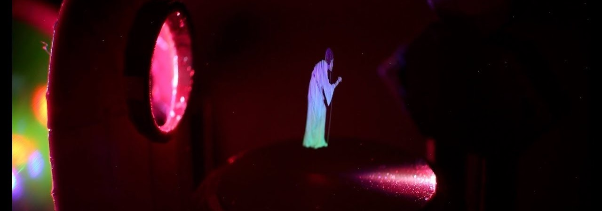

# Seismometry

Seismometry is concerned with recording vibrations of the Earth. These vibrations may come from earthquakes, oceanic disturbances, human activity, or a range of other sources, and contain useful information about their source and the medium they travel through. In this practical you will gain practical experience in how seismometers are used to record seismic signals, and how these signals can be analysed to reveal insights into the properties of the earth or the signal source. Time series analysis and signal recording is widely applicable across many applications beyond seismology – this is a broadly applicable skill set to develop.

!!! info "Practicalities"

    === "Flavour profile"

        | Taste | Rating |
        | ----------- | :------------------------------------: |
        | Electronics, signal processing, etc. | :material-star: :material-star-outline: :material-star-outline: |
        | Computation: simulation, analysis, etc. | :material-star: :material-star: :material-star: |
        | Dexterous experimentation | :material-star-outline: :material-star-outline: :material-star-outline: |

    === "Academic contact"

        <figure markdown>
        <a href="mailto:niam.askeydoran@utas.edu.au"><i class="fas fa-at fa-5x"></i></a>
        <figcaption><a href="">Niam Askey-Doran</a></figcaption>
        </figure>

    === "Location"

        The experiment takes place in the optics lab (Room 140, Physics building SB.AU.14, Sandy Bay)

---

## Content

--8<-- "includes/abbreviations.md"
