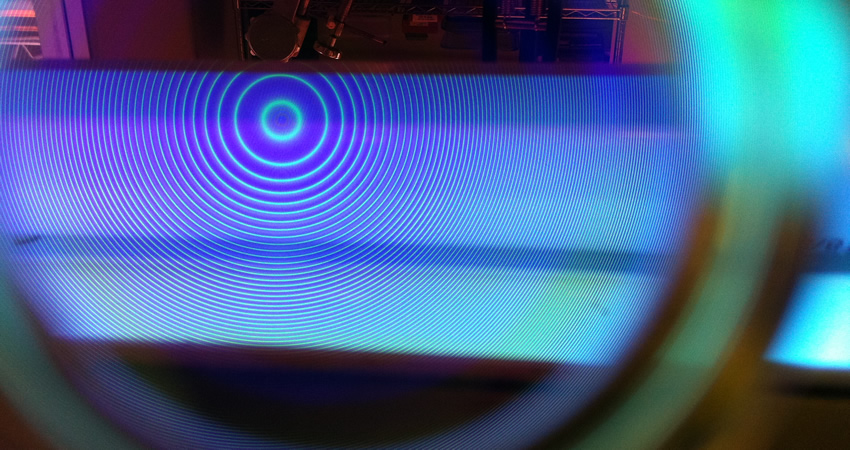

# The Zeeman effect in Mercury

The anomalous Zeeman splitting of the green line of mercury is observed using a Fabry-Perot Interferometer. The value of the Bohr magneton is obtained and the polarization of the line is studied. The experiment complements the lectures on the Zeeman effect and gives experience in the measurement of magnetic fields and in high-resolution spectroscopy.

!!! info "Practicalities"

    === "Flavour profile"

        | Taste | Rating |
        | ----------- | :------------------------------------: |
        | Electronics, signal processing, etc. | :material-star-outline: :material-star-outline: :material-star-outline: |
        | Computation: simulation, analysis, etc. | :material-star: :material-star-half-full: :material-star-outline: |
        | Dexterous experimentation | :material-star: :material-star: :material-star-outline: |

    === "Academic contact"

        <figure markdown>
        <a href="mailto:thomas.plunkett@utas.edu.au"><i class="fas fa-at fa-5x"></i></a>
        <figcaption><a href="">Tom Plunkett</a></figcaption>
        </figure>

    === "Location"

        The experiment takes place in the optics lab (Room 140, Physics building SB.AU.14, Sandy Bay)

---

## Content

<figure markdown>
<a href = 'ZEEMAN.pdf'> <i class="fas fa-file-pdf fa-3x"></i> </a>
    <figcaption>Lab notes
    </figcaption>
</figure>

## Additional resources

Etalon[^1]

<figure markdown>
<a href = 'LightMachinery-Etalonspecifications.pdf'> <i class="fas fa-file-pdf fa-3x"></i> </a>
    <figcaption>Etalon specifications
    </figcaption>
</figure>

[^1]: [Light Machinery](https://lightmachinery.com/) part number OP-7423-3371-5: Fused Silica, finesse >30, FSR $1~\mathrm{cm}^{-1}$, Thickness $3.371~\mathrm{cm}$

--8<-- "includes/abbreviations.md"
